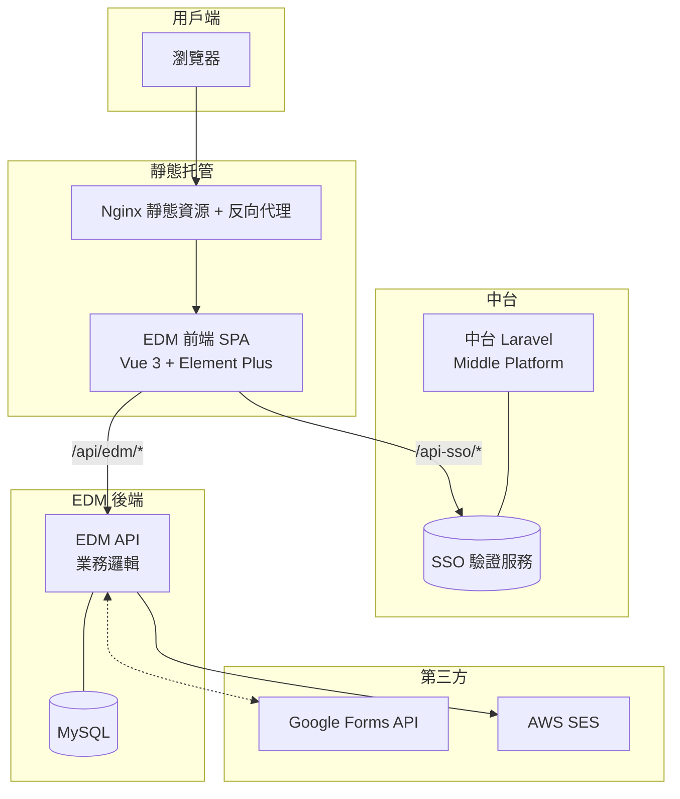
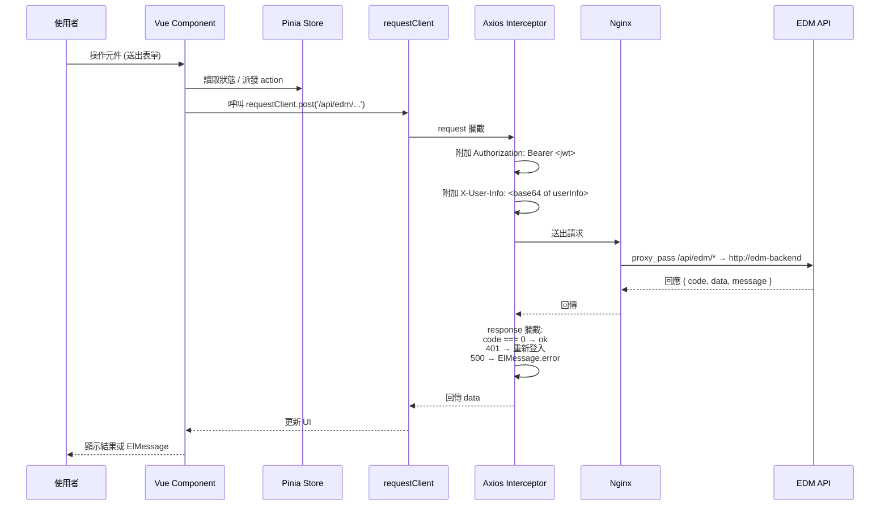
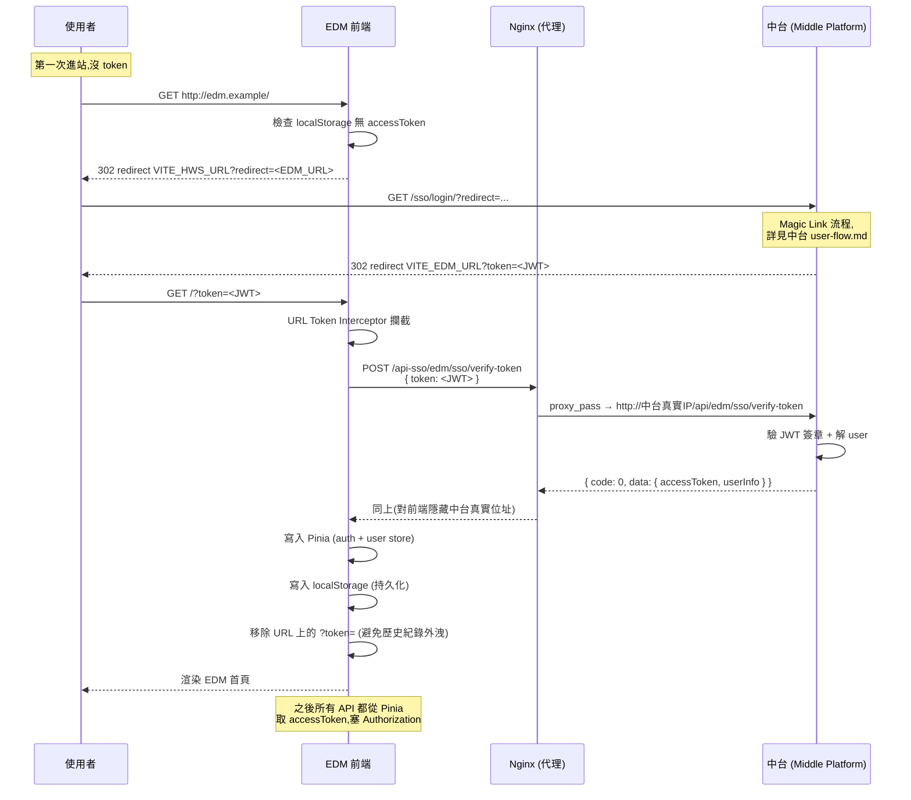

# Architecture

本文件描述 EDM Frontend 的整體架構、技術棧、資料流、與部署結構。採 C4 概念分層 + Mermaid 繪製。

目標讀者:**開發者、Architect、想理解內部結構的 Reviewer**。

> 大部分 Mermaid 圖與 SPA 內嵌的 [`apps/web-ele/src/views/sa-docs/architecture/index.vue`](../apps/web-ele/src/views/sa-docs/architecture/index.vue) 同步。Markdown 為正本,Vue 頁面為展示。

---

## Level 1 — System Context(整體架構)

「這個系統服務誰、又依賴誰?」



**重點**

- **EDM Frontend 不直接打中台或 EDM Backend** — 全部走自己的 nginx 反向代理(`/api-sso/*` → 中台,`/api/edm/*` → 後端)
- **隱身設計**:瀏覽器只看到 EDM 自己的網域,中台與後端的真實 IP 對外不可見
- **Mail / Google 由後端代理**:前端不直接呼叫第三方,避免 API key 外洩

---

## Level 2 — 前端技術棧(Component Diagram)

「打開 SPA,裡面是怎麼組起來的?」

```mermaid
graph TD
    Entry[main.ts 進入點] --> Bootstrap[bootstrap.ts 初始化]
    Bootstrap --> Prefs[@vben/preferences<br/>主題 / 語系]
    Bootstrap --> Access[@vben/access<br/>路由守衛]
    Bootstrap --> Stores[Pinia Stores<br/>auth / user / access]

    Stores --> Router[vue-router 動態路由]
    Router --> Layout[BasicLayout]
    Layout --> Pages{Pages}

    Pages --> Event[活動管理<br/>create / detail / list]
    Pages --> Member[人員管理]
    Pages --> Group[群組管理]
    Pages --> SA[SA 文件 內嵌頁]

    Pages --> UI[Element Plus]
    Pages --> Editor[CKEditor 5]
    Pages --> Charts[ECharts]
    Pages --> Table[VXE Table]

    Pages --> API[requestClient<br/>Axios 封裝]
    API --> Interceptor[攔截器:<br/>Token / X-User-Info / 錯誤訊息 / 逾時]
```

**分層職責**

| 層 | 路徑 / 套件 | 該做什麼 | 不該做什麼 |
| --- | --- | --- | --- |
| **進入點** | `apps/web-ele/src/main.ts` + `bootstrap.ts` | App 初始化、掛載 plugins | 業務邏輯 |
| **狀態管理** | `apps/web-ele/src/store/` (Pinia) | 全域狀態(auth、user、access) | 跨頁面短暫資料 |
| **路由** | `apps/web-ele/src/router/routes/modules/` | 動態路由 + 守衛 | 業務邏輯 |
| **頁面 (Views)** | `apps/web-ele/src/views/` | UI 組合、表單、表格 | 直接寫 SQL / API URL |
| **API Client** | `apps/web-ele/src/api/` (Axios `requestClient`) | 統一 HTTP 呼叫、攔截、錯誤處理 | 業務狀態(state) |
| **共用元件** | `apps/web-ele/src/components/` | 跨頁面 UI 元件 | 頁面特有邏輯 |
| **Vben 內建** | `@vben/*` workspace packages | layout / access / hooks / locales | 改動(改 framework code 風險高) |

---

## Level 3 — 資料流程(Sequence)

「使用者按一個按鈕,從 UI 到 API 之間發生了什麼?」



**攔截器設計重點**

| 攔截器 | 功能 | 出處 |
| --- | --- | --- |
| **request — Auth** | 從 Pinia 讀 `accessToken`,加進 `Authorization` header | `apps/web-ele/src/api/request.ts` |
| **request — User Info** | 把 user metadata 用 Base64 編碼後放進 `X-User-Info` (因為 HTTP header 不能含中文,直接放會 parse 錯) | 同上 |
| **response — Code** | 業務 `code !== 0` 視為錯誤,顯示 ElMessage | 同上 |
| **response — 401** | 清 token、redirect 回中台登入 | 同上 |
| **response — 逾時** | Axios timeout → 重試或提示使用者 | 同上 |

詳細的串接 contract 見 [api-integration.md](./api-integration.md)。

---

## Level 4 — SSO 登入時序

「使用者第一次進站,到看到 EDM 首頁,完整的 token 交換過程」



**設計重點**

- **Token 由前端持有**:存在 Pinia(memory)+ localStorage(持久),refresh 不會掉
- **Nginx 隱身**:瀏覽器看到的是 EDM 自己的 `/api-sso/*` URL,不會看到中台的 IP / domain
- **Token 從 URL 立即移除**:避免 `?token=...` 留在 browser history、Referer header、access log 裡
- **失效流程**:任何 API 收到 401 → 清 Pinia + localStorage → redirect 回中台。詳見 [user-flow.md 第 4 節](./user-flow.md#4-token-失效流程)

---

## Level 5 — 部署架構(Deployment)

「這個前端是怎麼跑起來的?」

```mermaid
graph LR
    Dev[開發者] -- git push --> GH[GitHub]
    GH -- pull_request --> CI[GitHub Actions<br/>Lint & Format Check]

    Dev -- docker compose up --build --> Build[多階段 Docker Build]
    Build --> Stage1[node:22-slim<br/>pnpm install<br/>pnpm build:ele]
    Stage1 --> Stage2[nginx:stable-alpine<br/>拷入 dist + nginx.conf]
    Stage2 --> Image[edm-image]
    Image --> Container[容器: edm-web-ele<br/>埠號 82 → 80]

    Container --> User[內部使用者]
```

**部署細節**

| 項目 | 值 | 出處 |
| --- | --- | --- |
| Builder Stage | `node:22-slim` + pnpm 10.4 + corepack | [Dockerfile](../Dockerfile) |
| Production Stage | `nginx:stable-alpine` + 客製 nginx.conf | 同上 |
| Build Command | `pnpm run build:ele -- --mode ${VITE_APP_ENV}` | 同上 |
| Build-time Env | `--build-arg APP_ENV=production\|uat` 切換 `.env.[mode]` | 同上 |
| Container Port | 82 (host) → 80 (container) | [docker-compose.yml](../docker-compose.yml) |
| Network | `edm-network` (本身) + `backend-net` (跟後端共用) | 同上 |
| 跨 Compose 整合 | `MiddlePlatform` 連 host 的中台 | 同上 |

完整部署流程見 [deployment.md](./deployment.md)。

---

## 6. 技術棧一覽

| 類別       | 技術                                       |
| ---------- | ------------------------------------------ |
| 框架       | Vue 3 (Composition API + `<script setup>`) |
| 建置工具   | Vite 5 + Turborepo (Vben monorepo)         |
| 套件管理   | pnpm 10.4                                  |
| 語言       | TypeScript 5.x                             |
| UI         | Element Plus                               |
| CSS        | Tailwind CSS + Element SCSS 客製           |
| 狀態管理   | Pinia                                      |
| 路由       | vue-router 4                               |
| HTTP       | Axios(封裝為 `requestClient`)              |
| 富文字     | CKEditor 5                                 |
| 圖表       | ECharts                                    |
| 表格       | VXE Table(高效虛擬滾動)                    |
| Excel I/O  | ExcelJS / xlsx                             |
| 圖表(文件) | Mermaid(經 `mermaid-view.vue` 元件渲染)    |
| Lint       | ESLint 9 + Prettier + Stylelint            |
| 容器       | Docker 多階段 build + Nginx                |

---

## 7. SSO 隱身代理(細節)

中台真實位址(可能是內網 `192.168.x.x` 或不對外的 domain)**不能讓瀏覽器看到**,否則:

- 攻擊者可以繞過前端直接打中台
- 內網拓樸外洩

**做法**:Nginx 反向代理。

```nginx
# 簡化示意,實際在 scripts/deploy/nginx.conf
server {
    listen 80;

    # 1. 前端靜態檔
    location / {
        root /usr/share/nginx/html;
        try_files $uri $uri/ /index.html;
    }

    # 2. SSO 隱身代理:對外是 /api-sso/,對內接中台
    location /api-sso/ {
        proxy_pass MiddlePlatform/;  # 中台真實位址,只有伺服器知道
        proxy_set_header Host $host;
        proxy_set_header X-Real-IP $remote_addr;
    }

    # 3. EDM 後端代理
    location /api/ {
        proxy_pass http://edm-backend/api/;
    }
}
```

**前端視角**

```ts
// 前端永遠呼叫 /api-sso/...,不知道 MiddlePlatform 存在
await requestClient.post('/api-sso/edm/sso/verify-token', { token });
```

對應的 ADR 在規劃中(尚未獨立成檔),概念整合在本節。詳見 [api-integration.md 第 4 節](./api-integration.md#4-sso-隱身代理).

---

## 8. Roadmap / 已知架構限制

| 項目 | 現況 | 下一步 |
| --- | --- | --- |
| Token 存 localStorage | XSS 風險 | 評估改用 httpOnly cookie + CSRF token(對應 [adr/0002](./adr/0002-token-storage.md)) |
| Refresh token 機制 | 無(中台目前只簽 access) | 待中台支援 refresh token 後接入 |
| 權限細分 | 所有登入者權限相同 | 加入 RBAC,Pinia 存 roles + meta |
| Loading / Error 樣式 | Element Plus 預設 | 統一抽出 `<PageLoading>` / `<ErrorBoundary>` 元件 |
| i18n | 框架支援但未啟用 | 加入 zh-TW / en 雙語 |
| 測試 | 無 | 加 Vitest + Playwright 端對端測試 |
| Bundle size | 未壓 / 未分析 | 跑 `vite-bundle-visualizer` 找肥點(CKEditor 通常很大) |
