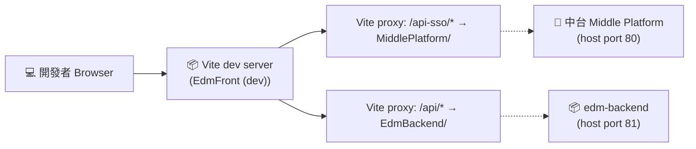
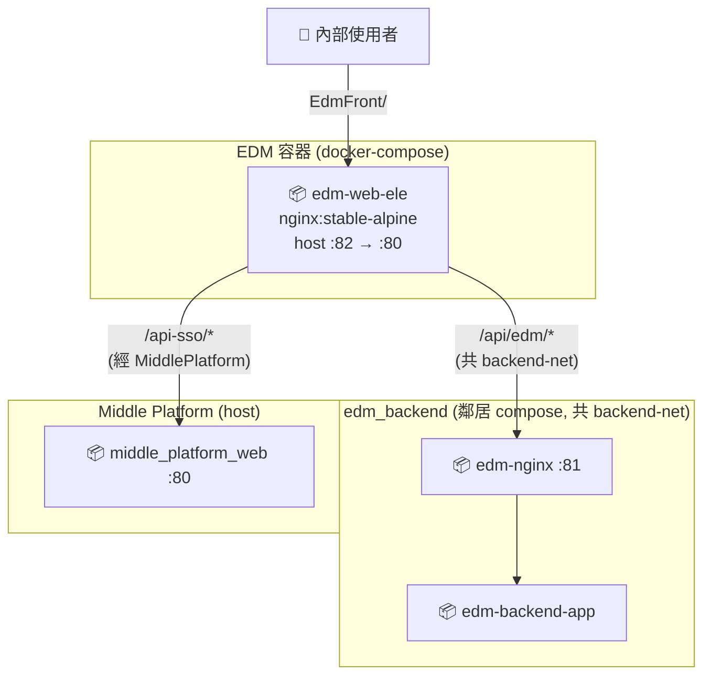
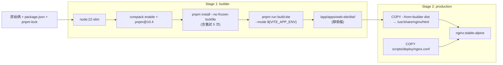

# Deployment View

本文件描述 EDM Frontend 的**部署單元**(單一 nginx container)、build 流程、與跨容器網路。

目標讀者:**Ops、Architect、想理解「跑起來長什麼樣」的 Reviewer**。

---

## 1. Deployment Diagram

### 1.1 Local Dev(`pnpm dev:ele`)

開發時不走 Docker,直接用 Vite dev server,熱重載。



### 1.2 Production-like(Docker)



**重點**

- 三個系統(中台 / EDM-FE / EDM-BE)各有自己的 docker-compose,**獨立啟停**
- EDM-FE 透過 `MiddlePlatform` 訪問 host 上的中台
- EDM-FE 透過 **共用 docker network**(`backend-net`)訪問 EDM-BE,不必經過 host
- Production 容器內 **只有 nginx + 靜態檔**,沒有 Node、沒有 build tool

---

## 2. 多階段 Docker Build

兩階段 build,production image 體積最小化:



**設計重點**

| Stage | 為什麼這樣設計 |
| --- | --- |
| Stage 1 用 `node:22-slim` | -slim 比完整版小很多,build 用足夠 |
| `corepack` 啟用 pnpm | 避免外部 npm install pnpm 的 timeout 問題 |
| `--no-frozen-lockfile` | 容忍 lockfile 不完全同步,作品集場景容忍度較高(prod 應該 `--frozen-lockfile`) |
| `pnpm install` 增加 retry | npm registry 偶爾 timeout,加 5 次重試 |
| Stage 2 只用 `nginx:alpine` | Production image 不含 Node 或任何 build tool,attack surface 最小 |
| `COPY --from=builder` | Multi-stage build 標準做法,不汙染 production layer |
| Skip Playwright | `PLAYWRIGHT_SKIP_BROWSER_DOWNLOAD=1` 避免抓 200MB 瀏覽器 |

---

## 3. 容器規格

### 3.1 `edm-web-ele`(production container)

| 項目 | 值 | 出處 |
| --- | --- | --- |
| Base image | `nginx:stable-alpine` | [Dockerfile](../Dockerfile) |
| 對外 port | **82** → 80(80 保留給中台) | [docker-compose.yml](../docker-compose.yml) |
| 靜態檔位置 | `/usr/share/nginx/html` | Dockerfile |
| Nginx config | `/etc/nginx/nginx.conf` (來自 `scripts/deploy/nginx.conf`) | Dockerfile |
| Network | `edm-network` (本身) + `backend-net` (external,跟後端共用) | docker-compose.yml |
| extra_hosts | `MiddlePlatform:host-gateway`(連 host 的中台) | docker-compose.yml |
| Healthcheck | `ls /usr/share/nginx/html/index.html`(改用檔案檢查避免網路誤判) | docker-compose.yml |
| Restart policy | `always` | docker-compose.yml |

---

## 4. 多環境 Build

支援透過 `--build-arg APP_ENV` 切換目標環境(對應不同 `.env.[env]` 檔):

```bash
# Production (預設)
docker build -t edm-image .

# UAT
docker build --build-arg APP_ENV=uat -t edm-image .

# Development(很少這樣 build,通常直接 pnpm dev)
docker build --build-arg APP_ENV=development -t edm-image .
```

**對應 .env 檔**

| `APP_ENV`     | 讀取的 .env        | 主要差異                             |
| ------------- | ------------------ | ------------------------------------ |
| `production`  | `.env.production`  | 正式 EDM URL、正式中台 URL           |
| `uat`         | `.env.uat`         | UAT 測試環境 URL                     |
| `development` | `.env.development` | MiddlePlatform (host) + 容器內部網路 |

---

## 5. 環境變數對應表

`.env.[mode]` 檔的關鍵變數(完整見 [`.env.example`](../.env.example) 或各環境檔):

| 變數 | 用途 | 例 |
| --- | --- | --- |
| `VITE_APP_TITLE` | 瀏覽器標籤 | `EDM 行銷管理` |
| `VITE_HWS_URL` | 中台登入頁,redirect 用 | `MiddlePlatform 登入頁` |
| `VITE_EDM_URL` | EDM 自己的對外 URL,redirect 回來時用 | `EdmFront/` |
| `VITE_SSO_VERIFY_URL` | 經 nginx 代理打中台的虛擬路徑 | `/api-sso/edm/sso/verify-token` |
| `VITE_PROXY_API_TARGET` | Vite dev server 的 API 代理 target(僅 dev) | `EdmBackend` |
| `VITE_PROXY_SSO_TARGET` | Vite dev server 的 SSO 代理 target(僅 dev) | `MiddlePlatform/` |

> **`VITE_*` 是 build-time 變數**,寫在 `.env` 裡,build 時就會被打進 bundle。**換環境必須重新 build image**,不能熱換。

---

## 6. 啟動 / 停止

### 6.1 Local Dev(快速開發迭代)

```bash
# 1. 安裝依賴(monorepo 一次裝完)
pnpm install

# 2. 跑 web-ele 的 dev server
pnpm dev:ele

# → EdmFront (dev)
```

dev mode 走 Vite,熱更新即時。

### 6.2 Docker(類 production)

```bash
# Build + 起服務(推薦)
docker compose up -d --build

# 只起服務(image 已有)
docker compose up -d

# 看 log
docker logs -f edm-web-ele

# 停止
docker compose down

# 完全清理
docker compose down -v --remove-orphans
```

啟動後:

| 服務         | 網址                                  |
| ------------ | ------------------------------------- |
| EDM Frontend | EdmFront/                             |
| (對中台)     | MiddlePlatform/ — 由中台容器提供      |
| (對 EDM-BE)  | EdmBackend/ — 由 edm-backend 容器提供 |

### 6.3 三系統一起跑

EDM-FE、EDM-BE、中台**各自獨立 compose**,要全部跑起來:

```bash
# 1. 起中台
cd ../Middle_Platform && docker compose up -d

# 2. 起 EDM 後端(注意 backend-net 是它建的)
cd ../edm_backend && docker compose -f docker-compose.yml -f docker-compose.local.yml up -d

# 3. 起 EDM 前端
cd ../EDM && docker compose up -d --build
```

啟動順序重要:**中台 + 後端先起來,前端才有東西可以打**。

---

## 7. Nginx 設定要點

`scripts/deploy/nginx.conf` 的關鍵 location:

```nginx
server {
    listen 80;
    server_name _;

    # SPA fallback(讓 vue-router history mode 正常)
    location / {
        root /usr/share/nginx/html;
        try_files $uri $uri/ /index.html;
    }

    # SSO 隱身代理 — 對外是 /api-sso/,對內接中台
    location /api-sso/ {
        proxy_pass MiddlePlatform/;  # 中台真實位址(視部署環境調整)
        proxy_set_header Host $host;
        proxy_set_header X-Real-IP $remote_addr;
        proxy_set_header X-Forwarded-For $proxy_add_x_forwarded_for;
    }

    # EDM 後端代理
    location /api/ {
        proxy_pass http://edm-backend/api/;
        proxy_set_header Host $host;
        proxy_set_header X-Real-IP $remote_addr;
        proxy_set_header X-Forwarded-For $proxy_add_x_forwarded_for;
    }

    # 自訂 MIME(讓 .mjs 用對 content-type)
    types { application/javascript js mjs; }
}
```

> 詳細的隱身代理設計見 [api-integration.md 第 4 節](./api-integration.md#4-sso-隱身代理)。

---

## 8. 健康檢查

| 檢查 | 方式 | 預期 |
| --- | --- | --- |
| Container alive | docker-compose `healthcheck: ls /usr/share/nginx/html/index.html` | ok |
| Web 是否服務 | `curl EdmFront/` | HTML 200 |
| 跨容器通 | container 內 `curl http://edm-backend/api/health` | 200 |

---

## 9. 已知部署限制

| 限制 | 影響 | 緩解 |
| --- | --- | --- |
| `--no-frozen-lockfile` | 不同人 build 出來的 deps 可能略不同 | Production 改 `--frozen-lockfile`,本機開發可保留容忍 |
| Healthcheck 用檔案檢查 | 無法偵測 nginx 真的能服務 | 加 HTTP 探活(`curl MiddlePlatform/`),但 nginx alpine 沒裝 curl,要先裝 |
| 中台位址 hardcode 在 nginx.conf | 換環境要改 .conf 重 build | 改用環境變數(envsubst)或在 build 時注入 |
| 沒 CDN | 靜態檔每次都從 nginx 服務 | Production 加 CloudFront / Cloudflare |
| 沒 TLS | 只跑 :80 | 部署時加 reverse proxy(nginx 上層 / Cloudflare)做 SSL termination |
| Pinia + localStorage 存 token | XSS 風險 | 評估改 httpOnly cookie([adr/0002](./adr/0002-token-storage.md)) |
| `vendor/` / `node_modules` 走 bind mount(若 dev compose 加上的話) | 啟動慢、跨平台問題 | Production 用 `COPY` 進 image,不 mount |
