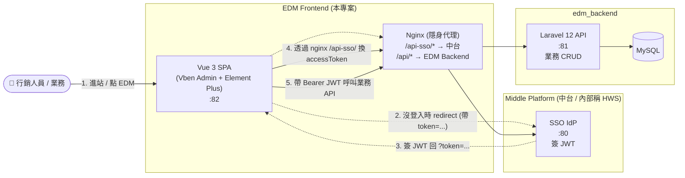

# Project Overview

本文件回答最根本的問題:**EDM Frontend 是做什麼的?它在整個生態裡扮演什麼角色?**

---

## 1. 系統定位 — 一句話

> **EDM Frontend 是「電子郵件行銷活動管理」的單頁應用**,給內部行銷人員、業務操作活動 / 人員 / 群組,並整合中台 SSO 與後端 API,作為使用者進入整個 EDM 生態的**唯一入口 UI**。

它**不**做的事:不簽 JWT、不存業務資料、不直接寄信。**所有重邏輯都在後端**,前端純粹是 UI + Client-side state。

---

## 2. 在生態裡的位置



**關鍵設計**

- **Nginx 隱身代理**:前端呼叫 `/api-sso/edm/sso/verify-token`,nginx 在伺服器內部把流量轉到中台真實位址(可能是內網 IP),瀏覽器 F12 永遠只看到 EDM 自己的網域 — 對外隱藏中台位址
- **JWT 自帶**:中台簽完 JWT 後,前端只把 token 存起來,後端用 `APP_KEY` 自驗,不必每個 request 回中台。詳見 [adr/0002-token-storage.md](./adr/0002-token-storage.md)
- **單一入口**:所有 API 流量都走 nginx,沒有 client 直連 cross-origin 的場景 — CORS / TLS / Rate Limit 都集中處理

---

## 3. 核心業務概念

| 業務名詞 | 對應後端 entity | UI 對應 |
| --- | --- | --- |
| **活動 (Event)** | `EDM\Event` | 活動列表、活動建立/編輯、活動詳細、邀請名單管理 |
| **人員 (Member)** | `EDM\Member` | 人員列表、Excel 批次匯入、通訊資料維護 |
| **群組 (Group)** | `EDM\Group` | 群組列表、群組詳細(含成員 + 活動)、新增群組 |
| **報名表 (Google Form)** | `Google\GoogleForm` | 為活動產製 / 編輯 Google 報名表 |
| **報名回應** | `Google\GoogleFormResponse` | 審核、查看開信率 / 報名轉換率 |
| **業務歸屬** | `member.sales_email` | 業務人員可看 / 編輯名下客戶 |

**核心 UI 流程**(由活動管理員主導):

```
建群組 → 匯入 Member(Excel)
       → 建活動(內容、時間、地點、圖片)
       → 從群組匯入邀請名單
       → 為活動建 Google 報名表
       → 寄發邀請信
       → 審核報名
       → 配置感謝函
       → 查看開信率與轉換率
```

---

## 4. Scope — 做什麼,不做什麼

### ✅ In Scope

- **CRUD UI**:Member / Group / Event / EventRelation 的所有列表、詳細、編輯介面
- **Excel 批次匯入**:大量人員匯入(`ExcelJS` / `xlsx`),預選群組鎖定避免歸類錯誤
- **富文字編輯**:活動內容、邀請信內文用 CKEditor 5 編輯
- **資料表格**:VXE Table 處理大量列(人員上千筆)
- **SSO 客戶端**:接收中台 redirect 帶來的 JWT,維持 session,過期自動導回中台
- **隱身代理**:透過 nginx `/api-sso/*` 對外隱藏中台真實位址
- **內嵌 SA 文件頁**:登入後可在系統內查看本專案 + 跨系統的 SA 文件(Mermaid 互動圖)

### ❌ Out of Scope

- **使用者註冊 / 登入 UI**:由 [Middle Platform](../../Middle_Platform) 負責,本系統只**接收** JWT
- **業務邏輯運算**:加總、過濾、聚合都由 [edm_backend](../../edm_backend) 處理,前端純粹顯示
- **資料持久化**:無 IndexedDB,只在 Pinia(memory)+ localStorage(token / userInfo)
- **直接呼叫第三方**:Google Forms / AWS SES 都由後端代理,前端不持有 API key
- **權限細節 (RBAC)**:目前所有通過 SSO 的使用者權限相同;細粒度 RBAC 屬於 Roadmap

> **這條 Scope 線**讓本系統只專注於 **UI 渲染 + SSO client + nginx 代理** 三件事,職責邊界清楚。

---

## 5. Stakeholders

| Stakeholder | 訴求 | 本系統如何回應 |
| --- | --- | --- |
| **活動管理員 (主要 End User)** | 從建群組到看成效的全流程操作 | 完整覆蓋業務流程的 UI |
| **業務人員** | 維護名下客戶聯絡資訊、業務 Email 綁定 | 業務專屬 view |
| **受邀者(外部)** | 收信 → 點連結 → 填表單 → 收感謝信 | 不進入本系統,透過 Email + Google Form 互動 |
| **中台 (IdP)** | 業務系統能正確接收 JWT | Nginx 隱身代理保護中台 IP;前端用 Pinia + localStorage 持久化 |
| **EDM 後端** | 收到正確的 Bearer JWT + 使用者資訊 | Axios interceptor 自動注入 `Authorization` + `X-User-Info` header |
| **Ops** | 部署單元清楚 | 多階段 Docker build,production 只剩 nginx + 靜態檔 |
| **資安 / 稽核** | 中台真實位址不可外洩 | Nginx 反向代理,F12 只看到 EDM 自己的網域 |

---

## 6. 設計原則

1. **單頁應用 + 客戶端狀態** — 所有路由與 state 由 vue-router + Pinia 處理,後端純 API,降低耦合
2. **隱身代理保護中台** — 對外不洩漏中台真實 IP / 內網位址(對應 [adr/2 章節](./architecture.md#sso-隱身代理))
3. **Token 由 client 持有,自帶到每個 request** — JWT 走 `Authorization: Bearer`,使用者 metadata 走 `X-User-Info` (Base64 編碼避中文錯誤)
4. **重資料表用 VXE Table** — Element Plus 的 el-table 在千筆資料容易卡,VXE Table 為 virtual scroll 設計
5. **Boring tech, Vben default** — 用 Vben 內建 utility(@vben/access、@vben/hooks),不自造輪子,降低維護門檻

---

## 7. 已開發 vs Roadmap

### ✅ 已開發

- **群組管理**:列表 / 分頁 / 即時狀態切換(`ElSwitch`)/ 詳情頁(人員 + 活動 + 分析 入口)/ 快速新增
- **人員管理**:Excel 批次匯入(預選群組鎖定)/ 通訊資料非同步編輯 / 狀態控制
- **基礎建設**:全系統 API Loading 狀態 / Feature-based 目錄結構(list/detail 分離)
- **SSO 整合**:Token 接收 + Nginx 隱身代理 + Pinia 持久化 + Header 自動注入
- **內嵌 SA 文件頁**:5 個 SA 文件子頁(architecture / use-case / requirement / api / er-diagram)

### 🗓️ 規劃中

- **活動系統**:活動建立流程、與群組/成員的雙向關聯
- **數據可視化**:群組與活動的成效分析圖表(ECharts)
- **權限細分**:超級管理員 / 一般行銷 / 業務 三層權限
- **Google Form 互動嵌入**:在 EDM 內直接看回應,不必跳到 Google

---

## 8. 非功能需求 (Non-Functional Requirements)

> 本專案為作品集 / Portfolio 性質,以下 NFR 是「設計時有考量」而非「壓測通過」的承諾。

| 類別 | 目標 | 設計回應 |
| --- | --- | --- |
| **可用性** | 中台短暫不可用時,**已登入使用者不立即被踢** | JWT 在本地 + localStorage,只要 token 沒過期還能用 |
| **資安** | 中台真實位址不對外暴露 | Nginx 隱身代理 (`/api-sso/*`) |
| **大量資料 UX** | 人員清單千筆不卡 | VXE Table virtual scroll;`Loading` 狀態回饋 |
| **多環境** | dev / uat / prod 切換不改 code | Vite `--mode` + `.env.[mode]` + `--build-arg APP_ENV` |
| **可演進** | 換 UI 套件 / 換中台不必大改 | Vben monorepo,UI 可換 web-ele(Element Plus)/ web-antd(Ant Design)等 |

---

## 9. Glossary

| 術語 | 中文 | 說明 |
| --- | --- | --- |
| **SPA** (Single-Page Application) | 單頁應用 | 整個 app 一次載入,後續 router 切頁不重整 |
| **IdP** (Identity Provider) | 身分提供者 | 簽 JWT 的中台,本系統的對手 |
| **Vben Admin** | — | Vue 3 企業級後台模板,提供 layout / access / locale 等基礎建設 |
| **Pinia** | — | Vue 3 官方推薦的 state management |
| **VXE Table** | — | 高效能 Vue 表格元件,virtual scroll |
| **CKEditor 5** | — | 富文字編輯器,給活動內容 / 邀請信內文用 |
| **ECharts** | — | 百度開源的圖表庫,for 數據可視化 |
| **Turborepo** | — | Monorepo 任務排程工具,Vben 用它管多 app |
| **HWS** | — | 中台 / Middle Platform 的內部代號 |
| **隱身代理** | — | Nginx 反向代理,對前端隱藏後端真實位址 |
| **ADR** | 架構決策紀錄 | 一份決策一份檔,寫「為何選 A 不選 B」 |
