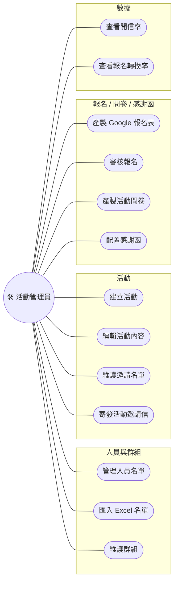
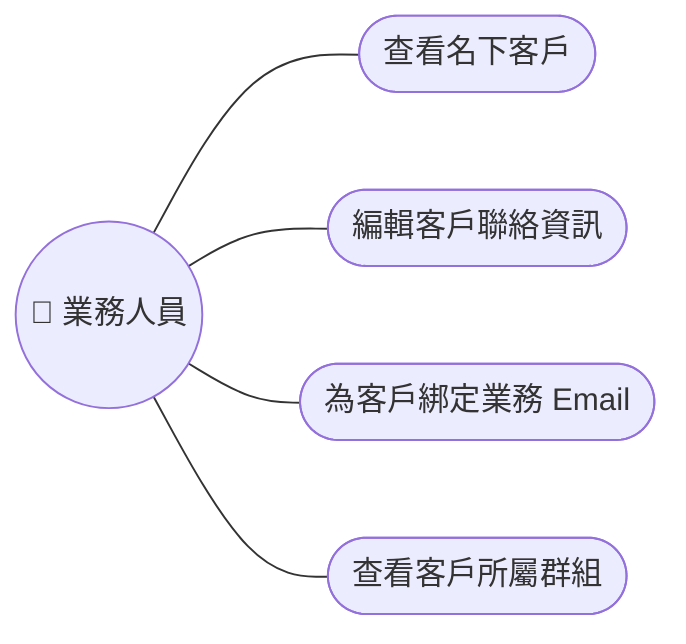
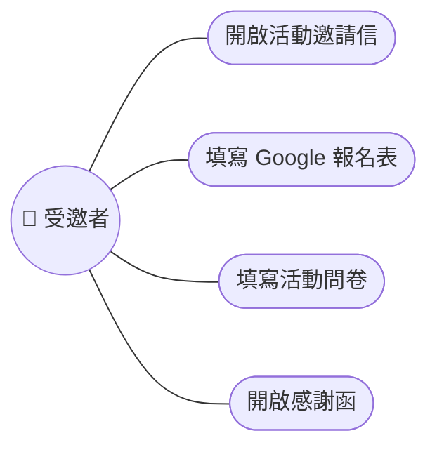
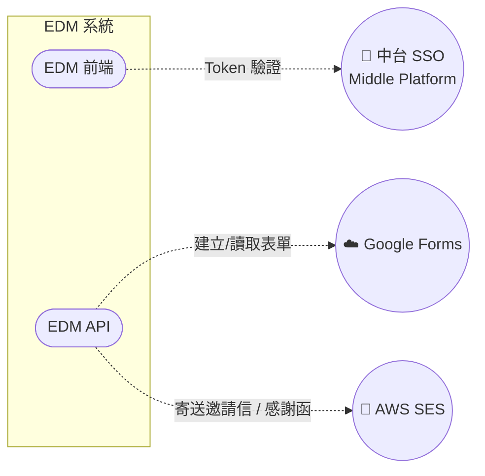
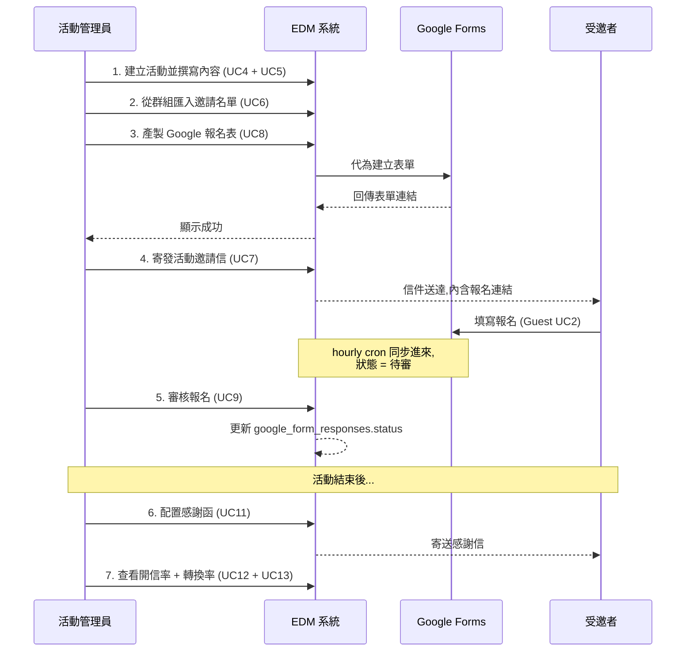

# Use Cases

本文件描述 EDM Frontend 的**角色 (Actor)** 與他們能在系統裡做的事 (Use Case),提供一張給開發者、PM、SA review 用的需求對齊圖。

> 本文件圖與 SPA 內嵌的 [`apps/web-ele/src/views/sa-docs/use-case/index.vue`](../apps/web-ele/src/views/sa-docs/use-case/index.vue) 同步。Markdown 為正本。

---

## 1. Actors 一覽

| Actor | 類型 | 說明 |
| --- | --- | --- |
| 🛠️ **活動管理員** | Primary | 主要使用者,負責整個活動生命週期(從建群組到看成效) |
| 💼 **業務人員** | Primary | 維護名下客戶的聯絡資訊與業務 Email 綁定 |
| 👥 **受邀者** | Secondary(外部) | 不進入 EDM 系統,透過 Email + Google Form 互動 |
| 🔑 **中台 SSO** | System | 簽 JWT 給 EDM,EDM 收到並驗證後進入 |
| ☁️ **Google Forms** | System | 透過後端代理建立 / 讀取表單 |
| 📧 **AWS SES** | System | 透過後端代理寄送邀請信 / 感謝函 |

---

## 2. Use Case Diagram — 活動管理員

主要 Actor,負責端到端的活動運營閉環。

### Use Case 詳細(主要)

| ID | 名稱 | 觸發條件 | 主要流程 | 後端 API(對應 [edm_backend api-spec](../../edm_backend/docs/api-spec.md)) |
| --- | --- | --- | --- | --- |
| UC2 | 匯入 Excel 名單 | 點「批次匯入」 | 選 Excel 檔 → 預覽欄位對映 → 預選群組鎖定 → 確認匯入 | `/api/edm/member/add`(批次) |
| UC4 | 建立活動 | 點「新增活動」 | 填表(時間 / 地點 / 內容 / 圖片)→ 後端產 `event_number=B<seq>` | `/api/edm/event/create` |
| UC6 | 維護邀請名單 | 進活動詳細 → 邀請名單頁 | 從群組匯入 / 手動加 / 移除(寫 `event_relation`) | `/api/edm/event/importGroup` |
| UC7 | 寄發活動邀請信 | 點「寄信」 | CKEditor 編輯內文 → 預覽 → 確認 → 後端 chunk + queue 寄 | `/api/edm/mail/inviteMail` |
| UC8 | 產製 Google 報名表 | 活動詳細 → 「建立報名表」 | 後端代呼叫 Google Forms API,綁定 `event_id` | `/api/edm/event/createGoogleForm` |
| UC9 | 審核報名 | 進報名回應頁 | 看 GoogleForm responses → 通過 / 不通過(改 `status`) | `/api/edm/event/updateResponseStatus` |
| UC12-13 | 查看數據 | 進活動分析頁 | ECharts 渲染後端統計回的 `google_form_stats` | `/api/edm/event/getGoogleForm`(含 stat) |

---

## 3. Use Case Diagram — 業務人員

對名下客戶進行聯絡資訊維護。

| ID | 名稱 | 主要流程 | 後端 API |
| --- | --- | --- | --- |
| UC1 | 查看名下客戶 | 列表頁過濾 `member.sales_email = <self>` | `/api/edm/member/list` |
| UC2 | 編輯聯絡資訊 | 進客戶詳細 → 編輯 email / mobile(獨立 endpoint) | `/api/edm/member/editEmail` / `editMobile` |
| UC3 | 綁定業務 Email | 編輯 `member.sales_email` | `/api/edm/member/editSales` |
| UC4 | 查看所屬群組 | 客戶詳細頁列出 `has_group` 關聯 | `/api/edm/member/view` |

> **權限細節**:目前 UI 上**所有角色看到的都一樣**,業務歸屬只是「軟過濾」(預設 filter 自己的 sales_email,但可手動清空看全部)。RBAC 在 Roadmap。

---

## 4. Use Case Diagram — 受邀者(外部 Actor)

**不進入 EDM 系統**,透過 Email + Google Form 互動。

**重點**:這四個 Use Case **完全不經過 EDM Frontend**,所以 Frontend 沒有對應的 view。但它們是業務流程的一環:

- **UC1 / UC4**:Email 由 EDM Backend 透過 AWS SES 寄出,**開信統計**透過 SES 的 webhook 回 backend(目前未實作,Roadmap)
- **UC2 / UC3**:Google Form 表單由 backend 代為建立,使用者填寫後**透過 backend 排程 cron**(每小時)同步回 DB

---

## 5. 系統 Actor — 與外部服務的互動

| 系統互動 | 觸發 | 介面 | 詳細 |
| --- | --- | --- | --- |
| **EDM 前端 ↔ 中台** | 使用者進站時 | HTTPS POST `/api-sso/edm/sso/verify-token` (走 nginx 代理) | [api-integration.md 第 4 節](./api-integration.md#4-sso-隱身代理) |
| **EDM API ↔ Google Forms** | 活動管理員建表單 / 排程同步 | `google/apiclient` SDK | 後端 [sequence-diagrams.md 第 3 節](../../edm_backend/docs/sequence-diagrams.md#3-google-form-回應同步) |
| **EDM API ↔ AWS SES** | 寄邀請信 | `aws/aws-sdk-php` | 後端 [sequence-diagrams.md 第 2 節](../../edm_backend/docs/sequence-diagrams.md#2-寄送活動邀請信) |

---

## 6. 典型情境 — 端到端活動運營

把上面零散的 UC 串成一條完整劇本:

---

## 7. 沒涵蓋的 Use Case(Roadmap)

| Actor | 還沒做 | 計畫 |
| --- | --- | --- |
| 活動管理員 | 活動模板 (Event Template) 重複用 | 後端已有 `event_template` 表,前端 UI 待補 |
| 活動管理員 | 排程寄信(指定時間) | 後端 Job 加 `delay`,前端加時間選擇器 |
| 活動管理員 | 寄信效果分析(SES bounce / complaint) | 後端接 SES webhook |
| 業務人員 | 名單 export Excel | UI 新增 export 按鈕,複用現有表格資料 |
| 系統管理員 | 角色權限管理 | RBAC 還沒實作 |
| 系統管理員 | 操作 Audit Log | 加 audit log table 與後台 view |
