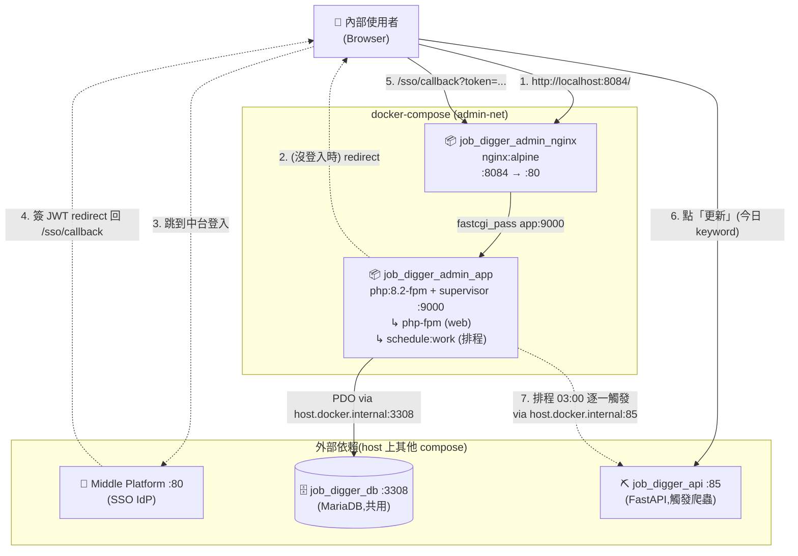
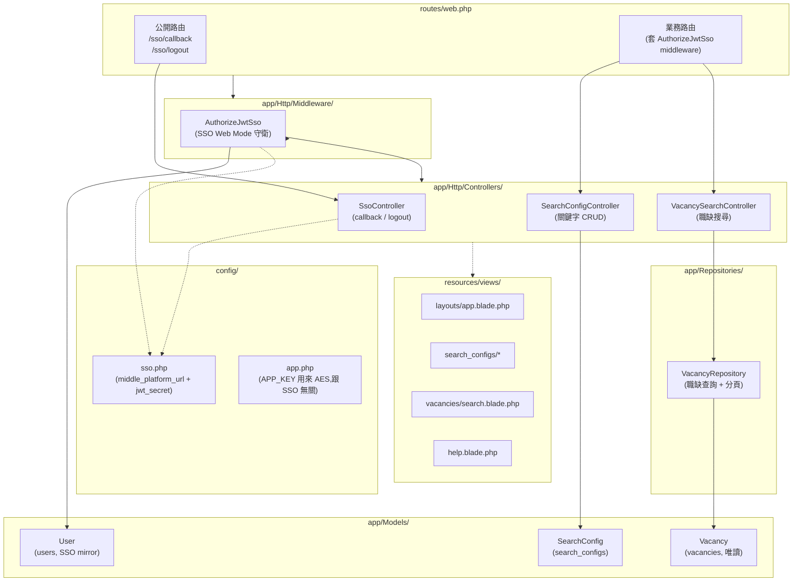
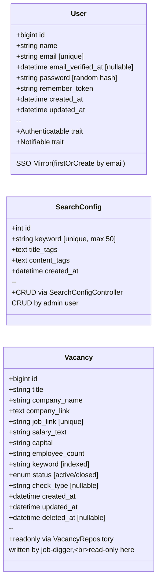

# Architecture

本文件描述 Job Digger Admin 的程式分層、模組組成、與 SSO 整合機制。採 C4 Container / Component 兩層 + Class Diagram。

目標讀者:**開發者、Architect、想理解內部結構或 SSO 接法的 Reviewer**。

---

## Level 1 — System Context

「這個系統服務誰、又依賴誰?」見 [`overview.md` 第 2 節](./overview.md#2-在生態裡的位置)。

---

## Level 2 — Container Diagram

「打開系統,裡面有哪些獨立部署單元?」



**容器規格**

| 容器 | 角色 | Host Port | Container Port |
|---|---|---|---|
| `job_digger_admin_nginx` | 反向代理 + 靜態檔 + FastCGI | **8084** | 80 |
| `job_digger_admin_app` | Laravel App (PHP-FPM) | — | 9000 |
| `job_digger_db` (鄰居 compose) | 共用 MariaDB | 3308 | 3306 |

> **為何 host port 是 8084 而非 84**:port 84 在 macOS / Docker Desktop 上被內部 reserve(`docker run -p 84:80 nginx` 會直接報錯,但 `lsof` / `ps` 都看不到誰佔)。改用 8084 避開。

---

## Level 3 — Component Diagram(Laravel App 內部分層)

「app 容器裡面,程式碼是怎麼分層的?」



**分層職責**

| 層 | 路徑 | 該做什麼 | 不該做什麼 |
|---|---|---|---|
| **Routes** | `routes/web.php` | path → controller 對映 + 套 middleware | 業務邏輯 |
| **Middleware** | `app/Http/Middleware/AuthorizeJwtSso.php` | SSO 驗證 + Auth::login + redirect 中台 | 業務邏輯 |
| **Controllers** | `app/Http/Controllers/EDM/`(SearchConfig / VacancySearch / Sso) | 接 request → 呼叫 Model / Repo → 回 view | 直接寫 SQL、跨業務編排 |
| **Repositories** | `app/Repositories/VacancyRepository.php` | 複雜查詢 + 分頁(本案 vacancies 是只讀外部表,需要封裝) | 業務規則 |
| **Models** | `app/Models/` (SearchConfig / Vacancy / User) | Eloquent + relations | 跨 entity 業務邏輯 |
| **Config** | `config/sso.php` | 集中 SSO 相關設定 | code 邏輯 |
| **Views** | `resources/views/` | Blade 模板渲染 | 業務邏輯(用 controller 傳變數進來) |

> **為何 Vacancy 用 Repository、SearchConfig 不用?**
> Vacancy 是**外部 schema**(job-digger 維護),查詢可能很複雜,用 Repository 隔離將來 schema 改動;SearchConfig 是 admin 自己常常 CRUD 的簡單資源,直接走 Eloquent Model 就好。

---

## Level 4 — Class Diagram(核心 Domain Model)



**設計重點**

- **User 不存密碼明文也不會被 check_password 驗** — `password` 欄位寫一個 `bcrypt(Str::random(40))` 的隨機值,只是讓 Laravel `User` 模型結構完整,實際登入只走 SSO
- **SearchConfig.title_tags / content_tags** 用 comma-separated string 而非 JSON,跟 job-digger 的 schema 對齊(同一張表,兩端讀)
- **Vacancy.job_link UNIQUE** — 防止 job-digger 重複插入(UPSERT 用),admin 不寫所以不影響

---

## Level 5 — SSO 整合(Web Mode 重點)

`AuthorizeJwtSso` middleware 三條路徑:

```mermaid
flowchart TD
    req[使用者 request 進來]
    check_auth{Auth::check?}
    has_token{?token=... in URL}
    decode[decodeJwt with SSO_JWT_SECRET]
    valid{JWT valid?}
    user[firstOrCreate User by email]
    login[Auth::login + session regenerate]
    intended[redirect()->intended('/')]

    save_url[session['url.intended'] = current_url]
    redirect_idp[redirect to MP /sso/login<br/>callback = APP_URL/sso/callback]

    pass[next() — 走業務邏輯]

    req --> check_auth
    check_auth -- 是 --> pass
    check_auth -- 否 --> has_token
    has_token -- 是 --> decode --> valid
    valid -- 是 --> user --> login --> intended
    valid -- 否 --> save_url
    has_token -- 否 --> save_url
    save_url --> redirect_idp
```

**關鍵設計**

| 點 | 為什麼 |
|---|---|
| `redirect URL = APP_URL/sso/callback`(固定) | 避免循環:中台白名單只認 `/sso/callback`,如果帶 `current_url` 過去可能因為白名單拒絕回不來 |
| `intended URL` 用 Laravel session 保留 | 登入完跳回原本想去的頁,UX 自然 |
| `firstOrCreate by email` | email 是中台的真實識別,本地 user 只是 session-carrier |
| `password = bcrypt(Str::random(40))` | passwordless,實際永遠不會被 `Auth::attempt` 驗 |

詳細時序見 [`sequence-diagrams.md` 第 1 節](./sequence-diagrams.md#1-sso-進站流程)。
為何選 Web Mode 而不是 API Mode 見 [`adr/0001-sso-web-mode.md`](./adr/0001-sso-web-mode.md)。

---

## 6. 跨系統互動(摘要)

| 互動場景 | 對手 | 介面 |
|---|---|---|
| SSO 進站 / 驗 JWT | 中台 | 瀏覽器 redirect + URL `?token=` 帶 JWT(走 host 上的中台) |
| 讀取 search_configs / vacancies | 共用 MariaDB | PDO via `host.docker.internal:3308` |
| 使用者手動觸發爬蟲(今日 keyword) | job-digger FastAPI | 瀏覽器 fetch `POST http://localhost:85/api/scrape/{id}` |
| 排程觸發爬蟲(非今日 keyword) | job-digger FastAPI | PHP container `POST http://host.docker.internal:85/api/scrape/{id}` |

完整時序圖見 [`sequence-diagrams.md`](./sequence-diagrams.md)。

---

## 6.1 排程設計(每日 03:00)

「為什麼非今日的 keyword 要走排程?」

- **避免使用者等**:單一 keyword 完整 ETL(A→B→C 三階段)約 30~60 分鐘,讓使用者在前台等不切實際
- **避免同時跑多個**:job-digger 後端有全域鎖(`HTTP 409`)只允許一個 keyword 同時在跑,排程序列化呼叫剛好對應這個限制
- **今日 keyword 例外**:剛建立的 keyword 使用者通常想立刻看結果,所以保留手動觸發按鈕(後端 API 用 `created_at = today` 條件守衛)

實作:

| 元件 | 角色 |
|---|---|
| `app/Console/Commands/ScrapeAllPending.php` | 撈出 `created_at != today` 的 keyword,逐一 POST + 輪詢 status |
| `routes/console.php` | 註冊 `Schedule::command('scrape:all-pending')->dailyAt('03:00')` |
| `supervisord.conf` | 用 `php artisan schedule:work` 取代傳統 cron,supervisor 管 long-running |
| `entrypoint.sh` | 啟動時 `exec supervisord` 同時拉起 php-fpm + scheduler |

詳見 [`sequence-diagrams.md` 第 4 節](./sequence-diagrams.md#4-排程觸發爬蟲)。

---

## 7. 已知架構限制 / Roadmap

| 項目 | 現況 | 下一步 |
|---|---|---|
| 沒接 refresh token | 中台沒給,access 過期 = 重登中台 | 等中台支援 refresh token |
| 權限細分 | 所有 SSO user 權限相同 | 加 RBAC,User 加 `roles` 欄位,middleware 套 `can:` |
| 觀測性 | dev:看 Laravel log;prod:無 | 加 Telescope 或 Sentry |
| 測試 | PHPUnit 框架在,沒寫 | 補 SearchConfig CRUD + AuthorizeJwtSso 的 feature test |
