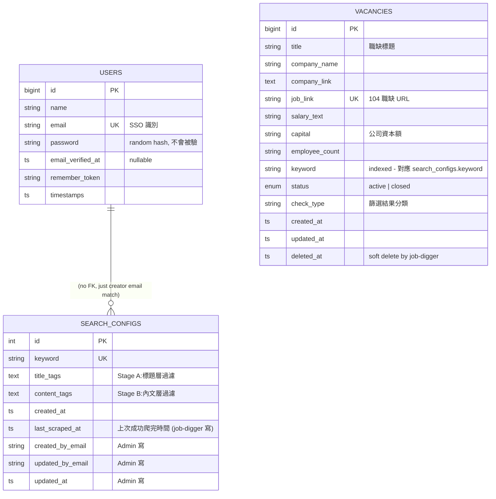

# Data Model

本文件描述 Job Digger Admin 在 MariaDB 中的資料結構。本系統**共用 `job-digger` 提供的 DB**(host port 3308),裡面的表分兩類:

- **業務表**(`search_configs` / `vacancies`)— 由 [job-digger](../../job-digger) 維護,本系統只是 client
- **本系統自有表**(`users`)— 給 SSO Web Mode 存使用者 mirror

目標讀者:**開發者、DBA、想理解持久化設計的 Reviewer**。

> 業務表的完整 schema 與欄位設計見 [job-digger/docs/data-model.md](../../job-digger/docs/data-model.md)。本文件聚焦於「Admin 怎麼用這些表」。

---

## 1. ERD(Admin 視角)



---

## 2. 表清單與擁有權

| 表 | 擁有者 | 本系統的存取 | Migration 位置 |
|---|---|---|---|
| `users` | **Admin 自有** | SSO `firstOrCreate` + Auth | [`database/migrations/0001_01_01_000000_create_users_table.php`](../database/migrations/0001_01_01_000000_create_users_table.php) |
| `search_configs` | job-digger | 全 CRUD | [`../../job-digger/init.sql`](../../job-digger/init.sql) |
| `vacancies` | job-digger | **唯讀** | 同上 |

> **重要:本系統只跑 `users` 的 migration**,`search_configs` / `vacancies` 由 job-digger 容器啟動時的 `init.sql` 建立。如果只起 admin 不起 job-digger,後者兩張表會不存在 → 進關鍵字頁會 500。

---

## 3. `users` 表(本系統自有)

```sql
CREATE TABLE users (
    id              BIGINT       PRIMARY KEY AUTO_INCREMENT,
    name            VARCHAR(255) NOT NULL,
    email           VARCHAR(255) NOT NULL UNIQUE,
    email_verified_at DATETIME   NULL,
    password        VARCHAR(255) NOT NULL,
    remember_token  VARCHAR(100),
    created_at      TIMESTAMP,
    updated_at      TIMESTAMP,
    UNIQUE KEY uniq_email (email)
);
```

**欄位重點**

| 欄位 | 設計考量 |
|---|---|
| `email` | **SSO 識別**,`firstOrCreate` 的 lookup key。從中台 JWT payload 來 |
| `password` | SSO 場景下**永遠不被 `Auth::attempt` 命中** — 寫一個 `bcrypt(Str::random(40))` 的隨機 hash 純粹滿足 Laravel `User` 模型的型別要求 |
| `name` | 從 JWT `display_name` claim 來,沒有就 fallback 為 email 的 `@` 之前 |
| `email_verified_at` | 目前不用(SSO 已經保證 email 真實),保留欄位以備未來用 |
| `remember_token` | Laravel "Remember Me" 用,SSO 場景沒在用 |

**寫入時機**:`AuthorizeJwtSso::resolveUser()`,只有「JWT 驗成功且本地沒這個 email」時才插入。

---

## 4. 共用表(來自 job-digger)

### 4.1 `search_configs`

```sql
CREATE TABLE search_configs (
    id INT AUTO_INCREMENT PRIMARY KEY,
    keyword VARCHAR(50) NOT NULL UNIQUE,
    title_tags TEXT,        -- Stage A 用
    content_tags TEXT,      -- Stage B 用
    created_at TIMESTAMP DEFAULT CURRENT_TIMESTAMP,
    last_scraped_at TIMESTAMP NULL DEFAULT NULL,         -- 最後一次成功完整跑完(A→B→C)的時間
    -- 以下 audit 欄位 admin (Laravel) 寫入,但 schema 統一由 job-digger 的 init.sql 管
    created_by_email VARCHAR(191) NULL,
    updated_by_email VARCHAR(191) NULL,
    updated_at       TIMESTAMP    NULL
);
```

**Admin 對它的操作**:

| 操作 | Controller method | SQL |
|---|---|---|
| 列表 | `SearchConfigController@index` | `SELECT * FROM search_configs ORDER BY id` |
| 建立 | `SearchConfigController@store` | `INSERT ...` |
| 編輯 | `SearchConfigController@edit/update` | `UPDATE ... WHERE id = ?` |
| 刪除 | `SearchConfigController@destroy` | `DELETE FROM search_configs WHERE id = ?` |

**注意**:本系統可以對它做任何修改,但**任何修改會立即影響 job-digger 下次跑爬蟲的關鍵字清單**。沒有「pending 狀態」的設計,改完就生效。

#### 重要欄位:`last_scraped_at`

| 點 | 細節 |
|---|---|
| 寫入者 | **job-digger** 的 `app.py::start_scraping_task` 在任務 stage 變 `done` 時 `UPDATE last_scraped_at = NOW()` |
| 寫入時機 | **僅成功跑完整輪**(三階段都過)— 中途失敗不更新,所以這欄永遠代表「上次拿到完整資料的時間」 |
| Admin 怎麼用 | 列表頁顯示 `{{ $config->last_scraped_at->diffForHumans() }}`(model 已 `'datetime'` cast),NULL 顯示「尚未執行」 |
| 排程怎麼用 | `ScrapeAllPending` command `ORDER BY last_scraped_at IS NULL DESC, last_scraped_at ASC` — 從沒跑過的最優先,接著最久沒更新的 |

#### 「今日 keyword」判斷

Admin 用 `created_at` 是不是 today 來決定 UI(顯示「更新」按鈕 vs「由排程執行」),後端 job-digger 也有同樣的守衛(`SELECT DATE(created_at) = CURDATE()`),擋住非當日的手動觸發。詳見 [`sequence-diagrams.md` 第 3-4 節](./sequence-diagrams.md#3-使用者手動觸發爬蟲今日-keyword)。

### 4.2 `vacancies`

```sql
CREATE TABLE vacancies (
    id BIGINT AUTO_INCREMENT PRIMARY KEY,
    title VARCHAR(255),
    company_name VARCHAR(255),
    company_link TEXT,
    job_link VARCHAR(500) UNIQUE,
    salary_text VARCHAR(100),
    capital VARCHAR(100) DEFAULT '0',
    employee_count VARCHAR(100) DEFAULT '',
    keyword VARCHAR(50),
    status ENUM('active','closed') DEFAULT 'active',
    check_type VARCHAR(255),
    created_at TIMESTAMP DEFAULT CURRENT_TIMESTAMP,
    updated_at TIMESTAMP ON UPDATE CURRENT_TIMESTAMP,
    deleted_at TIMESTAMP NULL,
    INDEX idx_keyword (keyword),
    INDEX idx_status (status)
);
```

**Admin 對它的操作**:

| 操作 | Controller method | 主要 SQL |
|---|---|---|
| 搜尋 + 分頁 | `VacancySearchController@index` | `SELECT * FROM vacancies WHERE deleted_at IS NULL AND keyword LIKE ? LIMIT 20 OFFSET ?` |

**完全不寫 vacancies**。理由:
- 寫入是爬蟲的責任,job-digger 用 UPSERT (`ON DUPLICATE KEY UPDATE job_link`)
- Admin 對 vacancy 的「軟刪」/「狀態變更」屬於 Roadmap 功能,目前沒做

詳細 schema(包含 `check_type` 的列舉值、`status` 轉換邏輯)見 [job-digger/docs/data-model.md](../../job-digger/docs/data-model.md)。

---

## 5. 索引與查詢規劃

| 主要查詢 | 命中索引 | 出處 |
|---|---|---|
| Admin 搜尋職缺(by keyword) | `vacancies.idx_keyword` | `VacancyRepository` |
| Admin 過濾活躍職缺 | `vacancies.idx_status` | 同上 |
| SSO 找 user(by email) | `users.uniq_email` | `User::firstOrCreate(['email' => ...])` |

> 目前資料量(<1k 個 vacancies)這些索引已足夠。萬一未來 vacancies 破萬,可以加複合 `(keyword, status, deleted_at)`。

---

## 6. 機敏資料考量

| 欄位 | 機敏性 | 處理 |
|---|---|---|
| `users.email` | 中(PII)| 索引但明文,內部系統可接受 |
| `users.password` | 低 | 雖然存 hash 但實際不被驗 |
| `vacancies.salary_text` | 低 | 公開的 104 資料 |
| `search_configs.keyword` | 低 | 自己設的搜尋字 |

> 整個系統服務的是「我自己 / 內部」,不對外開放,PII 處理屬於 Roadmap。

---

## 7. 為何不擁有業務 schema?

跟「業務表為何在 job-digger 而不在 Admin」這個設計選擇對應 [adr/0002-shared-mariadb-with-job-digger.md](./adr/0002-shared-mariadb-with-job-digger.md)。簡述:

- 爬蟲(job-digger)是「producer」,寫 vacancies
- Admin 是「consumer」,讀 vacancies + 寫 search_configs
- DB schema 的「擁有者」應該是寫入頻繁的那一方,不是讀的那一方
- 兩個服務在同一個 DB 是因為:輕量、避免跨 service 同步、單一真相來源

---

## 8. Roadmap

| 項目 | 計畫 |
|---|---|
| Admin 加「軟刪職缺」按鈕 | 寫 `UPDATE vacancies SET deleted_at = NOW() WHERE id = ?`(打破「不寫」原則) |
| Admin 加 audit log | 新建 `admin_audit_log` 表,記誰改了哪個 search_config |
| User 加 `role` | RBAC 用 |
| 統計頁 | aggregate query: `SELECT keyword, COUNT(*) FROM vacancies GROUP BY keyword` |
