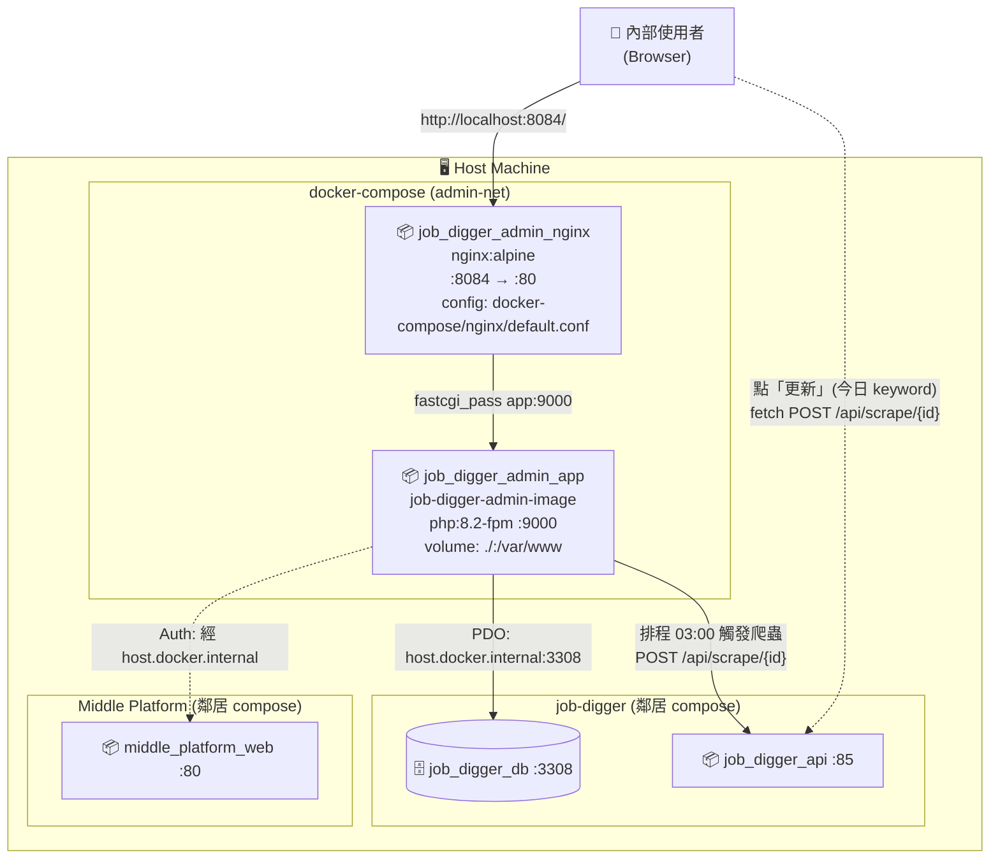

# Deployment View

本文件描述 Job Digger Admin 的**部署單元**(nginx + php-fpm 兩個 container)、build 流程、與跨容器網路。

目標讀者:**Ops、Architect、想理解「跑起來長什麼樣」的 Reviewer**。

---

## 1. Deployment Diagram



**重點**

- 三個系統各有自己的 docker-compose,**獨立啟停**
- Admin 透過 `host.docker.internal` 訪問 host 上的 中台 / job-digger
- Production 的 admin container 內 **跑 supervisor**,管 `php-fpm`(web) + `schedule:work`(排程);沒有 Node、沒有 Composer(已在 build 階段裝好)

---

## 2. 容器規格

### 2.1 `job_digger_admin_app`

| 項目 | 值 | 出處 |
|---|---|---|
| Base image | `php:8.2-fpm` | [Dockerfile](../Dockerfile) |
| PHP 擴充 | `pdo_mysql`、`mbstring`、`zip`、`pcntl` | Dockerfile |
| 系統依賴 | `git`、`curl`、`zip`、`unzip`、`libzip-dev`、`libonig-dev`、`netcat-openbsd`、**`supervisor`** | Dockerfile |
| Composer | 從官方 `composer:latest` image COPY 進來 | Dockerfile |
| 主程序 | **`supervisord`(PID 1)**,管理 `php-fpm` 與 `php artisan schedule:work` | [docker-compose/supervisor/supervisord.conf](../docker-compose/supervisor/supervisord.conf) |
| Entry | `entrypoint.sh`(設權限 → composer install → wait DB → migrate → exec supervisord) | [entrypoint.sh](../entrypoint.sh) |
| 對外 port | — (內部 9000,nginx fastcgi_pass) | docker-compose |
| Volume(dev) | `.:/var/www` (bind mount,熱更新) | docker-compose.yml |
| extra_hosts | `host.docker.internal:host-gateway`(連 host 的 MariaDB / 中台 / job-digger API) | docker-compose.yml |
| Restart policy | `unless-stopped` | docker-compose |

#### Supervisor 管理的子程序

| program | 命令 | 角色 |
|---|---|---|
| `php-fpm` | `/usr/local/sbin/php-fpm -F` | 接 nginx fastcgi 處理 web 請求 |
| `schedule` | `php artisan schedule:work` | Laravel 11 內建排程 ticker(取代傳統 cron),每分鐘自動 `schedule:run` |

兩個都設 `autostart=true / autorestart=true`,任一掛掉 supervisor 會立刻重起。`docker stop` 給 supervisord SIGTERM,supervisord 會優雅地把兩個 child 都收掉。

**驗證指令**:
```bash
docker exec job_digger_admin_app supervisorctl status
# 預期:
#   php-fpm    RUNNING   pid 12, uptime 0:00:05
#   schedule   RUNNING   pid 13, uptime 0:00:05
```

### 2.2 `job_digger_admin_nginx`

| 項目 | 值 |
|---|---|
| Image | `nginx:alpine` |
| 對外 port | **8084** → 80(原本想用 84,被 macOS / Docker Desktop 內部 reserve) |
| Config | `docker-compose/nginx/default.conf` |
| Volume | `.:/var/www`(讀 Laravel public/) |

> **8084 而非 84 的原因**:host port 84 在 macOS 上 docker daemon 會報 `address already in use`,但 `lsof` / `ps` 都看不到誰佔(可能是 Docker Desktop 內部 reserve 或 macOS 系統服務)。改用 8084 一勞永逸。

---

## 3. 環境變數

完整模板見 [`.env.example`](../.env.example)。**SSO 相關欄位最關鍵**:

| 變數 | 用途 | 預設(dev) |
|---|---|---|
| `APP_KEY` | **Laravel 內部加密用**(AES-256-CBC) | `base64:<32-byte>` (`php artisan key:generate` 產) |
| `APP_URL` | Admin 對外 URL,組 `/sso/callback` 給中台用 | `http://localhost:8084` |
| `MIDDLE_PLATFORM_URL` | 中台對外 URL(瀏覽器 redirect 過去) | `http://localhost` |
| `SSO_JWT_SECRET` | **SSO JWT 共用密鑰**,必須跟中台 `DJANGO_SECRET_KEY` 完全一致 | (不設) |
| `DB_HOST` | MariaDB host(透過 `host.docker.internal` 連) | `host.docker.internal` |
| `DB_PORT` | MariaDB port | `3308` |
| `DB_DATABASE` / `DB_USERNAME` / `DB_PASSWORD` | DB 連線 | (跟 job-digger 一致) |
| `SESSION_DRIVER` / `CACHE_STORE` / `QUEUE_CONNECTION` | 用 file/sync 避免汙染共用 DB | `file` / `file` / `sync` |
| `JOB_DIGGER_API_URL` | **瀏覽器**用的 job-digger API URL | `http://localhost:85` |
| `JOB_DIGGER_INTERNAL_URL` | **PHP container 內**用的 job-digger API URL(scheduler / Http::post) | `http://host.docker.internal:85` |
| `JOB_DIGGER_POLL_INTERVAL` | 排程輪詢任務狀態的間隔(秒) | `30` |
| `JOB_DIGGER_TASK_TIMEOUT` | 單一 keyword 等待上限(秒),超過視為卡死 | `7200` |

> **`APP_KEY` 跟 `SSO_JWT_SECRET` 的差別**:
> - `APP_KEY` 是 Laravel 內部用,**Laravel 強制要求 32 bytes**(AES-256-CBC),格式 `base64:<32-byte>`
> - `SSO_JWT_SECRET` 是 HS256 共用密鑰,跟著中台 `DJANGO_SECRET_KEY` 走,**長度寬鬆**
> - 兩者**不能合併**:中台的 SECRET_KEY 通常是長字串(不是 32 bytes),硬塞給 Laravel 當 APP_KEY 會炸
> - 詳見 [adr/0003-app-key-vs-jwt-secret.md](./adr/0003-app-key-vs-jwt-secret.md)

---

## 4. 啟動 / 停止

### 4.1 推薦:Docker

```bash
# 0. 先把鄰居都起來
cd ../Middle_Platform && docker compose up -d
cd ../job-digger && docker compose up -d   # 提供 MariaDB :3308 + FastAPI :85

# 1. 起 admin
cd ../job_digger_admin
cp .env.example .env       # 首次才需要

# 2. 必要設定:
#    - APP_KEY 跑 docker exec 後 php artisan key:generate
#    - SSO_JWT_SECRET 設成跟中台 DJANGO_SECRET_KEY 一樣
nano .env

# 3. up
docker compose up -d --build
```

啟動序(由 `entrypoint.sh` 主導):

1. 若無 `.env` 從範本複製
2. 修 `storage` / `bootstrap/cache` 權限
3. `composer install`(若 vendor 不存在)
4. 若 `APP_KEY` 為空就 `key:generate`
5. `nc -z host.docker.internal 3308` 等 DB 起來
6. `php artisan migrate --force`(只建 `users` 表)
7. 建立 `/var/log/supervisor` 目錄
8. **`exec /usr/bin/supervisord`**(同時拉起 php-fpm 與 schedule:work)

### 4.2 訪問

| 服務 | 網址 |
|---|---|
| Job Digger Admin | http://localhost:8084 |
| Middle Platform(SSO 中台) | http://localhost |
| job-digger FastAPI | http://localhost:85 |
| MariaDB(用 DBeaver 連) | `localhost:3308` |

### 4.3 停止 / 清理

```bash
docker compose down            # 停止 + 移除 container(留 volume)
docker compose down -v         # 完全清除
```

### 4.4 重置流程

如果 SSO 整合改 secret 後出現「Unsupported cipher / 401 / 500」:

```bash
# 1. 砍 bootstrap cache 殘留
docker exec job_digger_admin_app sh -c "rm -f /var/www/bootstrap/cache/*.php"

# 2. 強制砍 container 重來(restart 不夠,因為有 volume mount cache)
docker compose down && docker compose up -d
```

這個技巧是在我們踩 [adr/0003 雷](./adr/0003-app-key-vs-jwt-secret.md)時學到的:Laravel `bootstrap/cache/services.php` 在 image build 時會生成,即使 .env 改了也不會自動重新編譯。

---

## 5. Nginx 設定要點

`docker-compose/nginx/default.conf`:

```nginx
server {
    listen 80;
    server_name _;
    root /var/www/public;
    index index.php index.html;

    location / {
        try_files $uri $uri/ /index.php?$query_string;   # Laravel routing
    }

    location ~ \.php$ {
        fastcgi_pass app:9000;
        fastcgi_index index.php;
        fastcgi_param SCRIPT_FILENAME $document_root$fastcgi_script_name;
        include fastcgi_params;
        fastcgi_param HTTP_AUTHORIZATION $http_authorization;   # SSO JWT 用
    }

    location ~ /\.(?!well-known).* {
        deny all;     # 防止 .env / .git 外洩
    }
}
```

---

## 6. 健康檢查

| 檢查 | 方式 | 預期 |
|---|---|---|
| 整體 alive | `curl -I http://localhost:8084/` | HTTP **302**(redirect 到中台) |
| App 容器 | `docker exec job_digger_admin_app php -v` | PHP 8.2.x |
| DB 連得到 | `docker exec job_digger_admin_app nc -zv host.docker.internal 3308` | open |
| Laravel config OK | `docker exec job_digger_admin_app php artisan tinker --execute="echo config('sso.jwt_secret');"` | 跟中台 SECRET_KEY 一樣 |
| **Supervisor 兩隻都活著** | `docker exec job_digger_admin_app supervisorctl status` | `php-fpm` + `schedule` 都 RUNNING |
| **排程已註冊** | `docker exec job_digger_admin_app php artisan schedule:list` | 看到 `scrape:all-pending` ... `Daily at 03:00` |
| **能打到 job-digger** | `docker exec job_digger_admin_app curl -s http://host.docker.internal:85/health` | `{"status":"ok"}` |

> 整體 alive 看 **302** 才正確 — 200 反而異常(代表 SSO middleware 沒套到)。

---

## 7. 常用維運指令

```bash
# 進容器
docker exec -it job_digger_admin_app bash

# Artisan
docker exec job_digger_admin_app php artisan route:list
docker exec job_digger_admin_app php artisan migrate:status
docker exec job_digger_admin_app php artisan tinker

# 清 cache(.env / config 改完必跑)
docker exec job_digger_admin_app php artisan config:clear
docker exec job_digger_admin_app php artisan cache:clear

# 看 Laravel error log
docker exec job_digger_admin_app tail -50 /var/www/storage/logs/laravel.log

# nginx log
docker logs -f job_digger_admin_nginx

# Supervisor 管理(看 status / 重啟單一程序而不是整個 container)
docker exec job_digger_admin_app supervisorctl status
docker exec job_digger_admin_app supervisorctl restart schedule
docker exec job_digger_admin_app supervisorctl restart php-fpm

# 排程相關
docker exec job_digger_admin_app php artisan schedule:list                     # 看排程清單
docker exec job_digger_admin_app php artisan scrape:all-pending --dry-run      # dry run
docker exec job_digger_admin_app php artisan scrape:all-pending                # 立刻跑
docker exec job_digger_admin_app tail -f storage/logs/scrape-all-pending.log   # 看排程歷史

# 進 MariaDB(共用 job-digger 的)
docker exec -it job_digger_db mariadb -udeveloper -p job_digger
```

---

## 8. 已知部署限制

| 限制 | 影響 | 緩解 |
|---|---|---|
| Port 8084 不是「乾淨」port 84 | 不重要,只是 URL 不漂亮 | 接受,寫進文件 |
| `APP_KEY` 跟 `SSO_JWT_SECRET` 容易設錯 | SSO 直接炸(401 或 500) | `.env.example` 註解清楚 + ADR-0003 |
| `bootstrap/cache/*.php` 不會自動重新生成 | 改 .env 後 `restart` 不夠,要 `down/up` | 寫進 4.4「重置流程」 |
| Composer install 卡 npm registry timeout | build 失敗 | Dockerfile 加 retry(已加) |
| 無 healthcheck | docker-compose `depends_on` 不能保證 ready | 加 healthcheck endpoint(Roadmap) |
| 沒 TLS | 純 :8084 HTTP | 部署到 prod 時加 reverse proxy(Cloudflare / nginx 上層) |
| 沒 production compose | 所有設定都 dev | 寫 `docker-compose.prod.yml` overlay |
