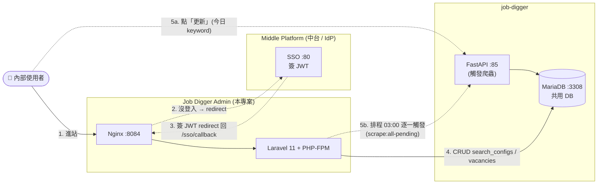

# Project Overview

本文件回答最根本的問題:**Job Digger Admin 是做什麼的?它在整個生態裡扮演什麼角色?**

---

## 1. 系統定位 — 一句話

> **Job Digger Admin 是「104 職缺爬蟲」的後台 UI**,給內部使用者(主要是我自己 / 行銷)設定爬蟲關鍵字、檢視抓回的職缺,並透過中台 SSO 完成身分驗證。

它**不**做的事:不執行爬蟲、不存爬蟲資料(都是 [job-digger](../../job-digger) 的責任)、不簽 JWT(中台的責任)。本系統純粹是 **「業務 UI + SSO 客戶端」**。

---

## 2. 在生態裡的位置



**關鍵設計**

- **SSO Web Mode**:第一次進站驗 JWT → 換成 Laravel session,後續用 cookie 不必每個 request 帶 token([adr/0001](./adr/0001-sso-web-mode.md))
- **共用 DB**:本系統不擁有業務 schema(`search_configs` / `vacancies` 由 job-digger 維護),只擁有自己的 `users` 表給 SSO 用([adr/0002](./adr/0002-shared-mariadb-with-job-digger.md))
- **APP_KEY 跟 SSO_JWT_SECRET 拆開**:Laravel 內部加密用 APP_KEY(必須 32 bytes),SSO 共用 secret 獨立成 `SSO_JWT_SECRET`,避免「中台用長字串簽 JWT」跟「Laravel 要 32-byte AES key」打架([adr/0003](./adr/0003-app-key-vs-jwt-secret.md))

---

## 3. 核心業務概念

| 業務名詞 | 對應 Model | UI 對應 |
|---|---|---|
| **搜尋配置 (SearchConfig)** | `App\Models\SearchConfig` | 關鍵字 CRUD 頁(`/search-configs`) |
| **職缺 (Vacancy)** | `App\Models\Vacancy` | 職缺搜尋頁(`/vacancies/search`,只讀) |
| **使用者 (User)** | `App\Models\User` | SSO 進來時自動建,無 UI |

業務流程:
```
我在 Admin 設定關鍵字(如 "PHP 後端")+ 過濾標籤(如 "後端,軟體")
   ↓
今日剛建立 → 列表出現「更新」按鈕 → 確認 ETL 提示 → 觸發 job-digger 爬蟲
過往 keyword → 顯示「由排程執行」,每天 03:00 由 schedule:work 自動跑
   ↓
job-digger 三階段(A→B→C)爬完寫進 vacancies + 更新 last_scraped_at
   ↓
我在 Admin 的職缺搜尋頁看結果(可依關鍵字過濾)
```

---

## 4. Scope — 做什麼,不做什麼

### ✅ In Scope

- **SearchConfig CRUD**:設定 / 編輯 / 刪除爬蟲關鍵字與過濾標籤
- **Vacancy 檢視**:列表、搜尋、分頁,**唯讀**
- **SSO 客戶端**:接收中台 redirect 過來的 JWT,以 Laravel session 維持登入
- **使用者操作說明**:`/help` 頁面

### ❌ Out of Scope

- **執行爬蟲**:由 job-digger 處理。本系統負責「**觸發**」(使用者按按鈕 / 排程 03:00 自動跑),爬蟲本身的 A→B→C 三階段邏輯都在 job-digger
- **寫 vacancies**:這是爬蟲的責任
- **業務 schema migration**:`search_configs` / `vacancies` schema 由 job-digger 的 `init.sql` 維護
- **使用者註冊 / 簽 JWT**:中台負責
- **權限細分 (RBAC)**:目前所有通過 SSO 的使用者權限都一樣

---

## 5. Stakeholders

| Stakeholder | 訴求 | 本系統如何回應 |
|---|---|---|
| **End User(我)** | 快速設關鍵字、看抓回的職缺 | 簡單 CRUD UI + 搜尋頁 |
| **中台 (IdP)** | 業務系統能正確接收 JWT | Web Mode middleware:第一次驗 JWT → Auth::login → session |
| **job-digger** | 後台只讀我寫的 search_configs,別亂改 vacancies | 只讀 vacancies,不寫 |
| **Ops(也是我)** | 部署單元清楚,啟停簡單 | docker-compose 兩個 container(nginx + php-fpm) |

---

## 6. 設計原則

1. **不擁有業務 schema** — 完全當 job-digger 的 client,DB 由它維護
2. **Web Mode SSO** — 不每個 request 帶 token,登入後走 Laravel session,UX 自然
3. **APP_KEY 跟 SSO_JWT_SECRET 拆開** — Laravel 內部加密跟 SSO 不該共用同一把 key
4. **Boring tech** — Laravel default(file session/cache,不用 Redis)
5. **Soft Delete 預設關** — 業務表是 job-digger 的,我不管;`users` 表也不需要 soft delete

---

## 7. 非功能需求 (NFR)

> 作品集 / Portfolio 規模,以下是設計時有考量,非壓測通過。

| 類別 | 目標 | 設計回應 |
|---|---|---|
| **可用性** | 中台短暫不可用時,**已登入使用者不立即被踢** | Laravel session 有效期間(預設 120 分鐘)維持登入 |
| **資安** | API 不被未授權呼叫 | `AuthorizeJwtSso` middleware 套全部業務路由 |
| **可演進** | 未來想接其他爬蟲 service 不必大改 | Repository 層隔離 DB 操作,Service 層可接外部 API |
| **故障隔離** | 中台 / job-digger 任一炸,本系統能優雅降級 | 中台炸:已登入仍可看資料;job-digger 炸:更新按鈕跳錯但 CRUD / 列表正常 |

---

## 8. Glossary

| 術語 | 中文 | 說明 |
|---|---|---|
| **IdP** (Identity Provider) | 身分提供者 | 簽 JWT 的中台 |
| **SP** (Service Provider) | 服務提供者 | 消費 JWT 的業務系統(本系統) |
| **Web Mode SSO** | — | JWT 第一次驗成 Laravel session,後續用 cookie。對比 API Mode(每個 request 帶 token) |
| **HS256** | — | JWT 對稱簽章演算法,中台跟本系統共享 `SSO_JWT_SECRET` |
| **APP_KEY** | — | Laravel 內部加密用的金鑰(AES-256-CBC),**跟 SSO 完全無關**,要求 base64:32-byte |
| **firstOrCreate** | — | Eloquent 的「找不到就建一筆」操作,SSO 用它從 JWT 建本地 user mirror |
| **ADR** (Architecture Decision Record) | 架構決策紀錄 | 一份決策一份檔,寫「為何選 A 不選 B」 |
