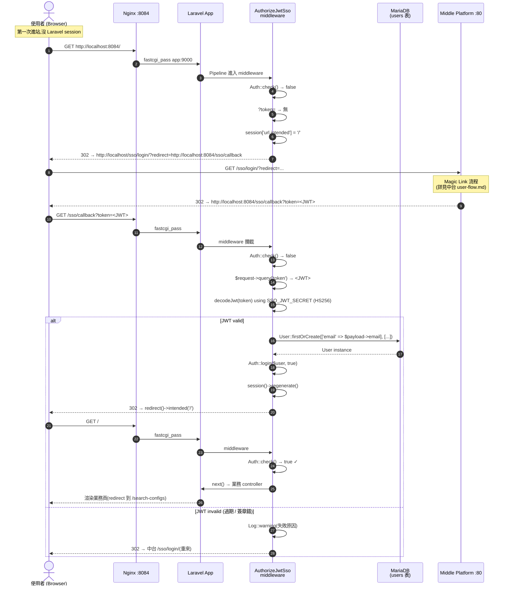
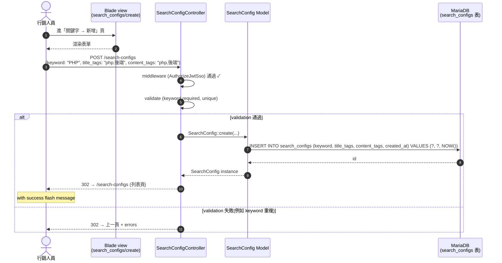
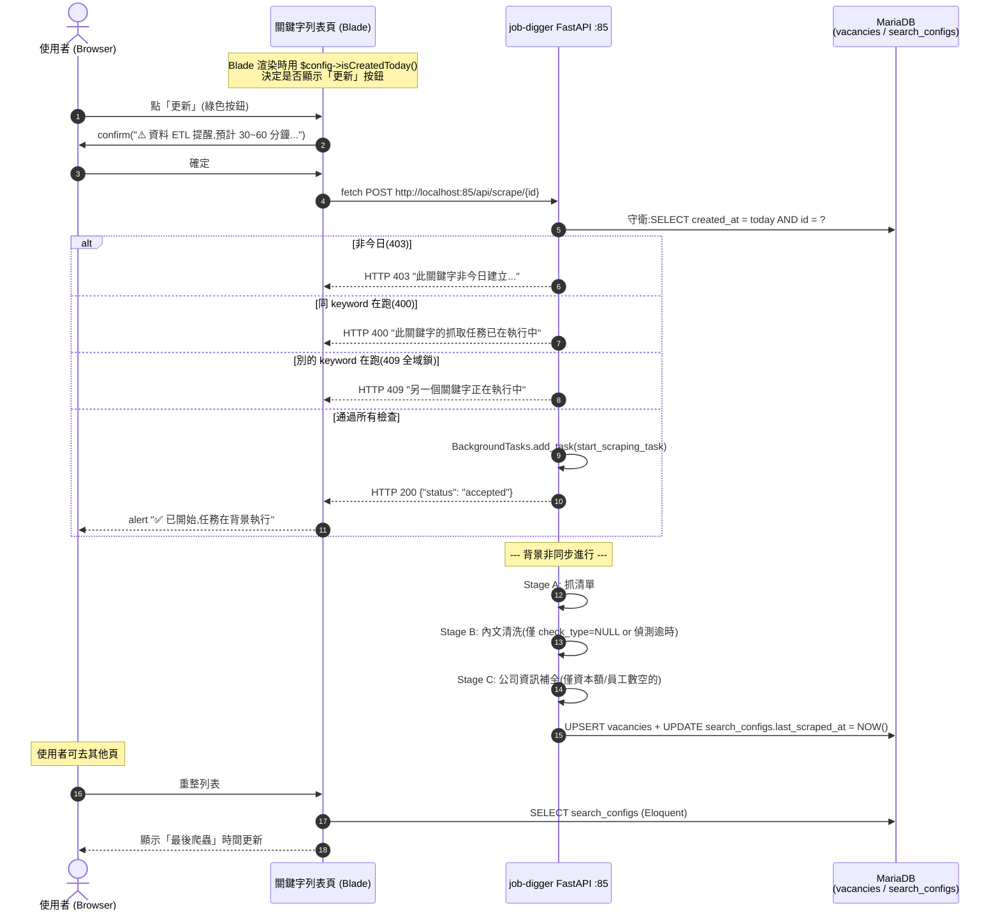
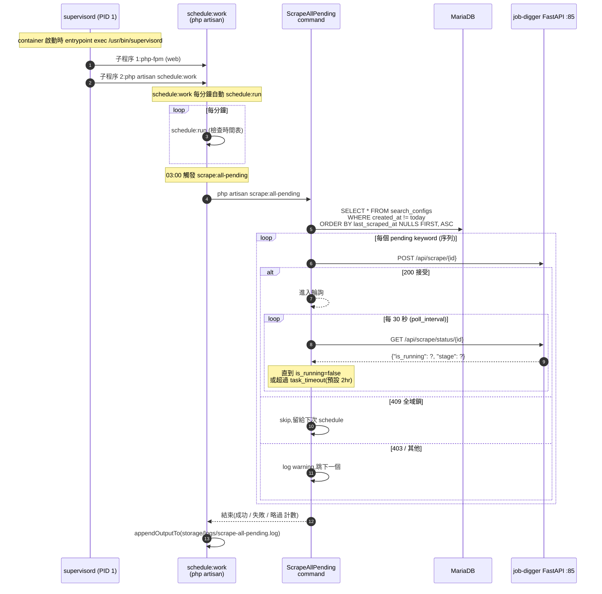
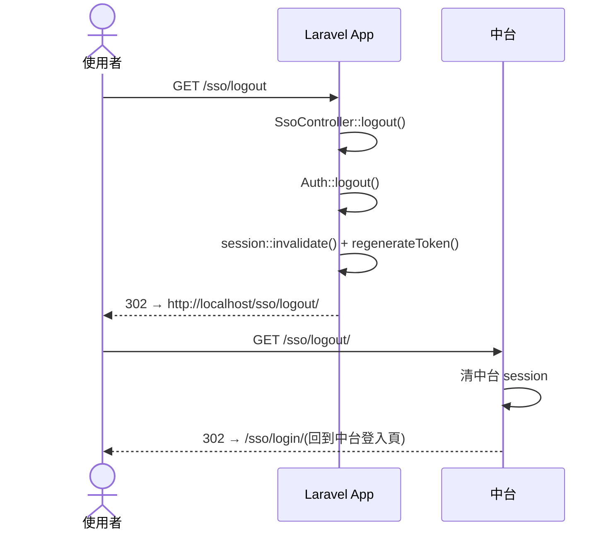
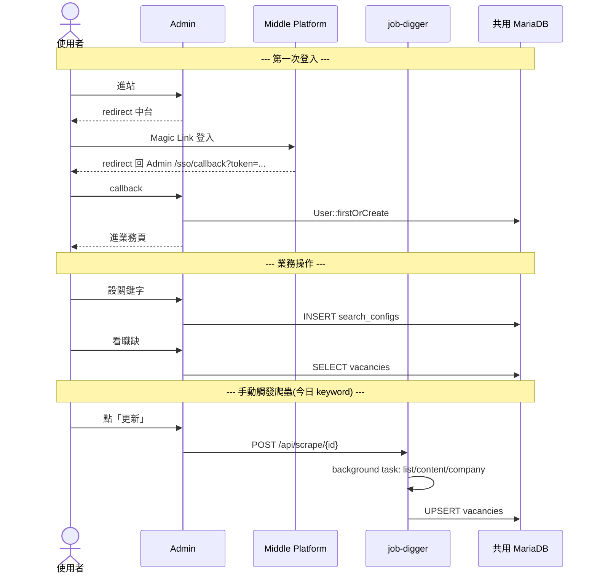

# Sequence Diagrams

本文件用 UML Sequence Diagram 描述 Job Digger Admin 的關鍵互動流程。目標讀者:**SA、開發者、想理解跨系統時序的 Reviewer**。

涵蓋以下流程:

1. SSO 進站(Web Mode)— 從沒登入到看見業務頁
2. Search Config CRUD(常見業務操作)
3. 使用者手動觸發爬蟲(今日 keyword)
4. 排程觸發爬蟲(非今日 keyword)

---

## 1. SSO 進站流程

「使用者第一次點 Admin URL,系統如何處理沒登入這件事?」



**關鍵設計細節**

| 步驟 | 為什麼這樣做 |
|---|---|
| `redirect URL = APP_URL/sso/callback`(固定) | 中台白名單比較容易管,且永遠回到固定接點 |
| `session['url.intended']` | Laravel 內建機制,登入完後 `intended('/')` 自動跳回 |
| `firstOrCreate by email` | email 是中台真實識別,本地 user 只是 mirror |
| `Auth::login + session::regenerate` | 防 session fixation attack |

詳細的 middleware code 見 [`app/Http/Middleware/AuthorizeJwtSso.php`](../app/Http/Middleware/AuthorizeJwtSso.php)。

---

## 2. Search Config CRUD 流程

「我登入後新增一個關鍵字,發生什麼?」



**重點**:
- middleware 只在 **request 進來時驗一次**,過了之後 controller 用 `Auth::user()` 取目前 user 不必再驗 JWT
- `unique:search_configs,keyword` 在 FormRequest validation 已經擋了重複,DB 的 UNIQUE INDEX 是 last line of defense

---

## 3. 使用者手動觸發爬蟲(今日 keyword)

「使用者剛建好 keyword 想立刻看結果,系統如何串到 job-digger?」

> 設計約束:**只有今日建立的 keyword** 才會在 admin 看到「更新」按鈕,過往 keyword 由排程處理(見第 4 節)。



**錯誤碼總表**

| HTTP | 場景 | 前端訊息 |
|---|---|---|
| 200 | 啟動成功 | ✅ 已開始,任務在背景執行 |
| 400 | 同 keyword 已在跑 | ⏸ 此關鍵字的任務已在執行中 |
| 403 | 非今日建立(守衛) | ⛔ 此關鍵字非今日建立,將由排程自動執行 |
| 404 | config_id 不存在 | ❌ 啟動失敗 |
| 409 | 別的 keyword 在跑(全域鎖) | ⏸ 另一個關鍵字正在執行中,請稍後再試 |

---

## 4. 排程觸發爬蟲

「過往 keyword 怎麼定期更新?排程是怎麼跑的?」



**設計重點**

| 項 | 說明 |
|---|---|
| 為何序列化 | job-digger 全域只允許一個 keyword 同時跑(避免多隻 Chromium 爆 RAM、CF ban) |
| 為何排除今日 | 使用者通常剛建好就想看結果,不想等到隔天;排程跳過今日避免和手動觸發撞車 |
| 為何用 schedule:work | Laravel 11 內建,自帶分鐘 ticker,**取代傳統 cron**;supervisor 管 long-running 重啟邏輯一致 |
| `withoutOverlapping(120)` | 跨日還沒跑完就不重複觸發(整輪 1~2 小時,鎖 120 分鐘安全) |
| `task_timeout` | 單筆 keyword 超過 2 小時視為卡死,放棄等待繼續下一個 |
| 觀測 | `storage/logs/scrape-all-pending.log` + `docker logs job_digger_admin_app`(supervisor stdout passthrough) |

**手動測試命令**

```bash
# 看會處理哪些 keyword(不實際觸發)
docker exec -it job_digger_admin_app php artisan scrape:all-pending --dry-run

# 實際跑(忽略 03:00 排程,立刻執行)
docker exec -it job_digger_admin_app php artisan scrape:all-pending

# 確認 supervisor 兩支程序都活著
docker exec job_digger_admin_app supervisorctl status

# 看排程列表
docker exec job_digger_admin_app php artisan schedule:list
```
## 5. 登出流程



**注意**:中台 logout 不會撤銷已簽出去的 JWT(JWT 是無狀態的)。在 Admin 端的 `Auth::logout` 只清本地 session,但 30 分鐘內如果有人複製了 token 還能再進來(走 SSO callback 路徑驗 JWT 通過後重建 session)。要立即撤銷需要 token blacklist,目前 SSO 流程未實作。

---

## 6. 跨系統 overview

整合三個流程的整體 view:



完整中台側的 SSO 細節見 [Middle Platform user-flow.md](../../Middle_Platform/docs/user-flow.md)。
完整 job-digger 側的爬蟲細節見 [job-digger sequence-diagrams.md](../../job-digger/docs/sequence-diagrams.md)。
