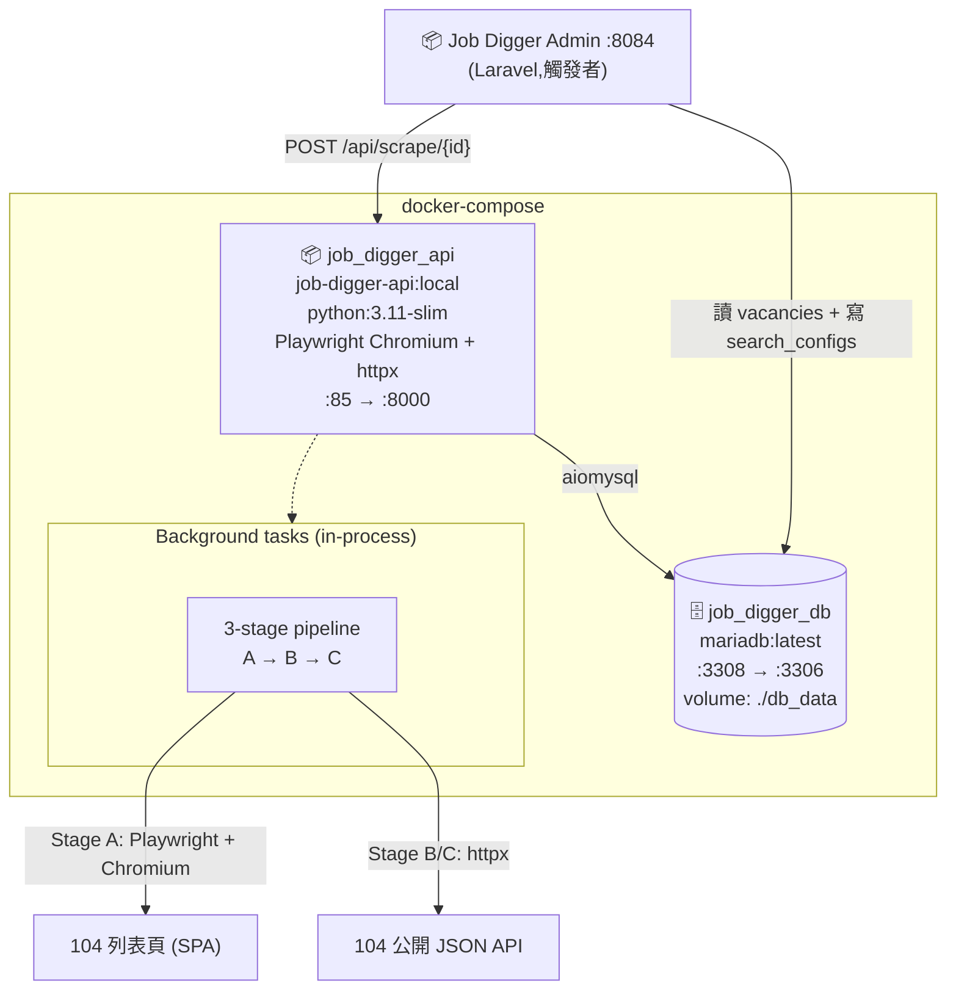
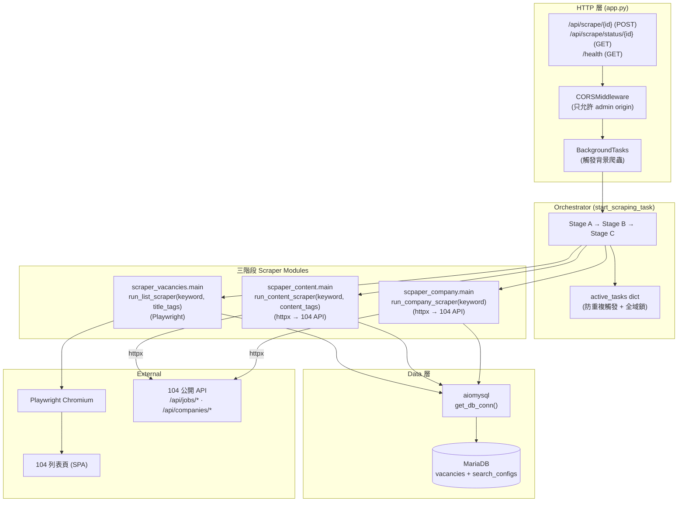
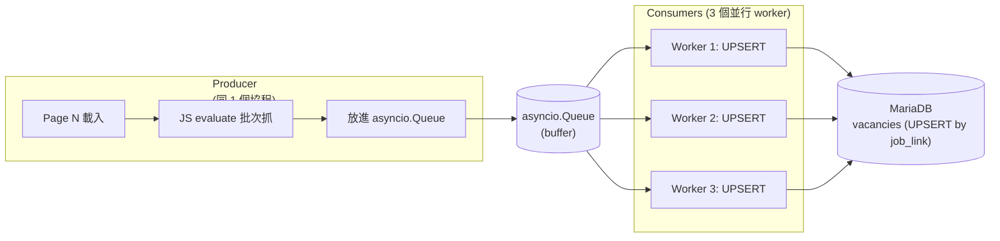
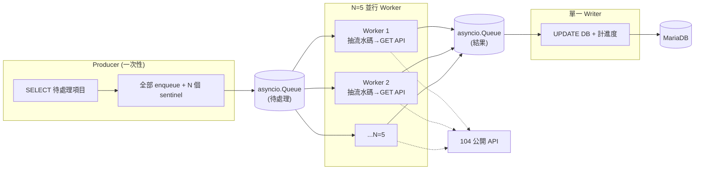

# Architecture

本文件描述 Job Digger 的整體架構、三階段 pipeline、與生產者-消費者模型。融合了原 [SD_Crawler_Architecture.md](./legacy/SD_Crawler_Architecture.md) 的內容(已 supersede,保留在 legacy/)。

目標讀者:**開發者、Architect、想理解爬蟲設計或反爬策略的 Reviewer**。

---

## Level 1 — System Context

「這個系統服務誰、又依賴誰?」見 [`overview.md` 第 2 節](./overview.md#2-在生態裡的位置)。

---

## Level 2 — Container Diagram

「打開系統,裡面有哪些獨立部署單元?」

**容器規格**

| 容器 | 角色 | Host Port | Container Port |
|---|---|---|---|
| `job_digger_api` | FastAPI + 三階段爬蟲 | **85** | 8000 |
| `job_digger_db` | MariaDB(共用 with admin)| **3308** | 3306 |

> **為何 API 跟爬蟲在同一個容器**:背景任務用 FastAPI `BackgroundTasks` 在同 process 跑,沒拆 worker 容器。對單機規模(我自己用)夠了;規模大可以拆 RQ/Celery + Redis(對應 [adr/0001-fastapi-vs-django.md](./adr/0001-fastapi-vs-django.md) 的 Roadmap)。

---

## Level 3 — Component Diagram(內部分層)

**分層職責**

| 層 | 路徑 | 該做什麼 | 不該做什麼 |
|---|---|---|---|
| **HTTP** | `app.py` | 接 POST → 驗 config 存在 → dispatch background | 業務邏輯、爬蟲細節 |
| **Orchestrator** | `app.py::start_scraping_task` | 三階段順序、active_tasks 追蹤、例外 swallow | 直接打 Playwright |
| **Scrapers** | `scraper_vacancies/` `scpaper_content/` `scpaper_company/` | Stage A 操作 Playwright;Stage B/C 用 httpx 打 104 API。各自抽資料、寫 DB | 跨階段協調 |
| **Data** | `app.py::get_db_conn` + scraper 內 SQL | aiomysql 連線、UPSERT | 商業邏輯 |

> **三個 scraper 模組都各自寫 DB**(用 `get_db_conn`),而不是統一由 Orchestrator 收 queue 寫。因為三階段的寫入內容不同(A 寫 vacancies 主檔、B 寫公司欄位、C 更新 check_type),用同個 worker 反而要傳一堆狀態。

---

## Level 4 — 核心架構:每個 Stage 各自的並發模型

三個 stage 的特性不同,並發策略也不同:

### 4-1. Stage A — Producer-Consumer(Playwright 限制下)

清單採集的瓶頸是「網頁載入慢」與「DB 寫入快」之間的不對稱,且 104 翻頁本身**只能 sequential**(並行翻頁立刻被偵測為機器人)。

| 元件 | 設計理由 |
|---|---|
| **單一 Producer** | 104 翻頁本身是 sequential,並行翻頁容易被偵測為機器人 |
| **3 個 Consumer** | DB UPSERT 雖然快,但 1 個 worker 跟不上 producer 的批次速度,3 個是 sweet spot |
| **asyncio.Queue 不限大小** | producer 翻完整個 keyword(可能 1k 筆)記憶體還能裝得下,不必 backpressure |
| **UPSERT (ON DUPLICATE KEY UPDATE)** | 重跑爬蟲不會重複插入(`job_link` 是 unique) |

### 4-2. Stage B / Stage C — Producer / Worker / Writer(API 模式)

Stage B/C 改成打 104 公開 API 後(見 [ADR-0005](./adr/0005-stage-bc-switch-to-104-api.md)),單筆 cost 大幅下降,可以放心**多 worker 平行打 API**。但 DB 寫入仍需單線(aiomysql 連線不能併發),所以採用 **Producer / Worker / Writer** 三段。

| 元件 | 設計理由 |
|---|---|
| **N=5 Worker(env 可調)** | API 端不會跳 CF,可以高度平行;5 是「快但不被 IP rate-limit」的甜蜜點 |
| **每 Worker request 後 sleep 0.3s** | 避免短時間集中流量被 104 IP-based rate limiter 攔下 |
| **單一 Writer** | `aiomysql` 連線本質上不可併發,Writer 模式天然把寫入序列化,順便集中管理進度計數 |
| **Sentinel 終止信號** | Worker 收到 sentinel 就把它丟給 out-queue 收尾;Writer 等到收滿 N 個 sentinel 才結束 |
| **Worker 失敗只跳過該筆** | API 暫時 403/429 退避 30 秒重試一次,仍失敗就不寫 DB,下次 SELECT 再撈到 |

---

## Level 5 — 三階段 Pipeline 詳述

### Stage A — 清單採集(Producer)

`scraper_vacancies/main.py::run_list_scraper(keyword, title_tags)`

1. **末頁探測 hack** — 在跳轉欄位輸入 `9999`,讓 104 顯示真實末頁(避免 brute-force 翻頁)
2. **逐頁抓** — 每頁向下捲動觸發 JS render,然後 `page.evaluate` 一口氣抽出所有職缺卡片
3. **錨點回溯** — 從 `.info-job__text` 元素往上找最近的職缺卡片容器(避免 hardcode XPath)
4. **第一道過濾** — 檢查標題是否含 title_tags 任一個,不含就跳過(在 producer 端就過濾,減少寫入量)
5. **寫進 vacancies**(只填 title / company / job_link / salary,公司詳細資訊空著等 Stage C)

詳細時序見 [`sequence-diagrams.md` 第 1 節](./sequence-diagrams.md#1-stage-a-清單採集-producer-consumer)。

### Stage B — 內文深度過濾(104 API)

`scpaper_content/main.py::run_content_scraper(keyword, content_tags)`

1. 從 DB 撈出 `check_type IS NULL` 或上次偵測逾時的 vacancies
2. 從 `job_link` regex 抽流水碼,組 API URL:`/api/jobs/{job_no}`
3. `httpx` GET,取三個欄位:
   - `data.jobDetail.jobDescription` — 工作內容
   - `data.condition.other` — 加分/必要條件
   - `data.condition.specialty[].description` — 擅長工具陣列
4. 依優先序比對 `content_tags`(first match wins):
   1. 工作內容含關鍵字 → `check_type = '工作內容有含關鍵字'`
   2. 加分條件含關鍵字 → `check_type = '加分條件或必要條件內有含關鍵字'`
   3. 擅長工具含關鍵字 → `check_type = '僅有擅長工具含關鍵字...'`
   4. 都沒中 → `check_type = 'no_match'`
5. **不刪除不通過的紀錄** — 保留作為 audit trail
6. 比對前對 HTML 字串做 `_strip_html` + `html.unescape`,然後 `lowercase + 去空白` 後做 substring

> **為何 B 在 C 之前**:先過濾掉內文不要的職缺,才不用浪費時間/API quota 在不要的職缺上補公司資料。

### Stage C — 公司資料補全(104 API)

`scpaper_company/main.py::run_company_scraper(keyword)`

1. **去重撈取**:`SELECT ... GROUP BY company_link WHERE capital = '0' OR employee_count = ''`
2. 從 `company_link` regex 抽流水碼,組 API URL:`/api/companies/{company_no}/content`
3. `httpx` GET,取兩個欄位:`data.capital` 與 `data.empNo`(API 回傳已是字串格式,例:`"6000萬元"`、`"16人"`)
4. 批次 UPDATE 回 vacancies(同 `company_link` 的所有職缺一起更新)

> **去重是關鍵**:同個 keyword 可能 100 個職缺只屬於 20 家公司,如果不去重就會重複打 100 次 API,白白浪費時間 + 對 104 不友善。

---

## 6. 跨系統互動(摘要)

| 互動場景 | 對手 | 介面 |
|---|---|---|
| Admin 觸發爬蟲 | Job Digger Admin | HTTP `POST /api/scrape/{config_id}` 或 `/api/scrape/scheduled/{id}` |
| Admin 查爬蟲狀態 | 同上 | HTTP `GET /api/scrape/status/{config_id}` |
| 健康檢查 | k8s / Ops | HTTP `GET /health` |
| 讀 search_configs | DB(共用) | aiomysql `SELECT ... WHERE id = ?` |
| 寫 vacancies | DB(共用) | aiomysql UPSERT / UPDATE |
| 爬 104 列表頁 | site (SPA) | Playwright Chromium(Stage A) |
| 打 104 公開 API | site (JSON) | httpx async client(Stage B/C) |

詳細時序圖見 [`sequence-diagrams.md`](./sequence-diagrams.md)。

---

## 7. 技術棧一覽

| 類別 | 技術 |
|---|---|
| 語言 | Python 3.11 |
| Web Framework | FastAPI(自帶 OpenAPI / Swagger UI on `/docs`)|
| Async | `asyncio` |
| 爬蟲引擎(Stage A) | Playwright(Chromium) + playwright-stealth |
| HTTP Client(Stage B/C) | `httpx`(async,直打 104 公開 JSON API) |
| DB Driver | `aiomysql`(async MySQL/MariaDB client)|
| DB | MariaDB latest |
| 容器 | Docker multi-stage(builder 用 python:3.11-slim) |
| Lint / Format | `flake8` + `black` + `isort` |
| Pre-commit | `pre-commit` 框架 |

---

## 8. Roadmap / 已知架構限制

| 項目 | 現況 | 下一步 |
|---|---|---|
| 沒 schedule | 被動觸發(等 Admin 點按鈕) | 加 cron / Celery beat |
| BackgroundTasks 在同 process | 重啟 API 會中斷正在跑的爬蟲 | 拆 RQ / Celery worker 容器 |
| 沒進度回報 | Admin 只能 polling status,看不到「跑到第幾頁」 | 加 WebSocket / SSE 推進度 |
| 反爬只用 stealth(Stage A)| Stage B/C 已改 API 不再需要;Stage A 仍依賴 stealth | 找 Stage A 對應的 list API,完全脫離 Chromium |
| 同個 IP 跑太久會被 ban | 目前單機 | 加 IP 輪換(若擴大規模) |
| 失敗重試 | 沒 — 拋例外只記 log | 加 retry decorator(重試 3 次,指數 backoff) |
| 觀測性 | print 到 docker log | 加結構化 log + Prometheus metrics |
