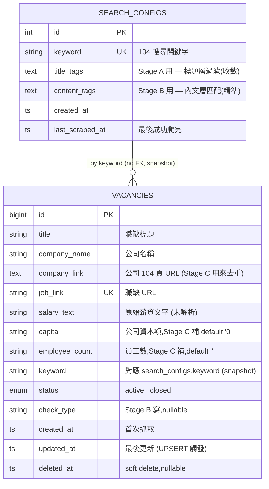

# Data Model

本文件描述 Job Digger 在 MariaDB 中的資料結構。本系統**擁有兩張共用業務表**(`vacancies` / `search_configs`),由本系統的 `init.sql` 啟動時建立,**[Job Digger Admin](../../job_digger_admin) 共用同一個 DB 但只是 client**。

目標讀者:**開發者、DBA、想理解資料怎麼流動的 Reviewer**。

---

## 1. ERD



> **沒有真正的 FK** — `vacancies.keyword` 是 `search_configs.keyword` 的 snapshot 字串,不是 FK。理由見下節。

---

## 2. 表清單與擁有權

| 表 | 擁有者 | Producer(誰寫) | Consumer(誰讀) |
|---|---|---|---|
| `search_configs` | 本系統(schema)/ Admin(content) | Admin CRUD | 本系統:`start_scraping_task` 撈 keyword + title_tags + content_tags |
| `vacancies` | 本系統 | 本系統 三階段 pipeline | Admin 列表 / 過濾 |

> **「Schema 擁有者」vs「Content 擁有者」是不同的事**。`search_configs` 的 schema 在本系統的 `init.sql` 裡(因為跟 vacancies 在同個 DB,init.sql 一起建),但**內容**完全是 Admin 在管(Admin 那邊有 SearchConfig model 做 CRUD)。本系統只**讀**它。

---

## 3. `search_configs`

```sql
CREATE TABLE search_configs (
    id INT AUTO_INCREMENT PRIMARY KEY,
    keyword VARCHAR(50) NOT NULL UNIQUE,
    title_tags TEXT,                                -- Stage A 用:職缺標題需含其中之一才寫入
    content_tags TEXT,                              -- Stage B 用:工作內容/條件/擅長工具需含其中之一才標 pass
    -- audit 欄位:admin (Laravel) 寫入,但 schema 統一在 init.sql 管
    created_by_email VARCHAR(191) DEFAULT NULL,     -- 建立者 email
    updated_by_email VARCHAR(191) DEFAULT NULL,     -- 最後更新者 email
    created_at TIMESTAMP DEFAULT CURRENT_TIMESTAMP,
    updated_at TIMESTAMP NULL DEFAULT NULL,         -- admin 編輯時寫入
    last_scraped_at TIMESTAMP NULL DEFAULT NULL     -- job-digger Stage A→B→C 全跑完才寫
);

INSERT INTO search_configs (keyword, title_tags, content_tags)
VALUES ('php', 'php,PHP,軟體,資訊,後端', 'php,PHP,laravel,Laravel')
ON DUPLICATE KEY UPDATE
    title_tags = VALUES(title_tags),
    content_tags = VALUES(content_tags);
```

**欄位重點**

| 欄位 | 設計考量 |
|---|---|
| `keyword` | UNIQUE — 同個關鍵字只能有一筆設定 |
| `title_tags` | **標題層過濾**,comma-separated。Stage A 在搜尋結果中**標題含其一才寫入** vacancies(用來收斂職缺類別) |
| `content_tags` | **內文層匹配**,comma-separated。Stage B 進職缺頁,工作內容/條件/擅長工具含其一才標 `工作內容有含關鍵字`/etc. |
| `created_by_email` / `updated_by_email` | admin (Laravel) 寫,記錄是誰建立/最後改了這筆 keyword |
| `created_at` / `updated_at` | admin 寫(`updated_at` 由 Laravel `update()` 自己塞,不走 MariaDB ON UPDATE) |
| `last_scraped_at` | job-digger Stage A→B→C 全跑完才寫入 |

> **Schema 擁有權**:整張表的欄位都在這裡管,雖然 `created_by_email` 等是 admin Laravel 寫入,但**不在 admin 跑 migration**。理由:單一真相來源;Laravel 那邊只跑自己的 `users` migration,不碰 `search_configs`。

**為何拆兩個欄位**(2026-05 重構):

舊版只有一個 `filter_tags`,Stage A 跟 Stage B 共用 → 出現「我想找 SA 職缺但要會 PHP」這種需求就破功:Stage A 用 `PHP` 過濾標題,SA 標題不含 PHP 全部被擋掉,Stage B 連跑都跑不到。拆成兩欄後可以「標題像 SA、內文需 PHP」精準交集。詳見 [adr/0004-split-title-and-content-tags.md](./adr/0004-split-title-and-content-tags.md)。

**本系統如何用它**:

```python
# app.py::start_scraping_task
await cur.execute(
    "SELECT keyword, title_tags, content_tags FROM search_configs WHERE id = %s",
    (config_id,),
)
config = await cur.fetchone()
keyword = config["keyword"]
title_tags = [t.strip() for t in (config["title_tags"] or "").split(",") if t.strip()]
content_tags = [t.strip() for t in (config["content_tags"] or "").split(",") if t.strip()]
# title_tags 給 Stage A,content_tags 給 Stage B
```

---

## 4. `vacancies`(主要業務表)

```sql
CREATE TABLE vacancies (
    id BIGINT AUTO_INCREMENT PRIMARY KEY,
    title VARCHAR(255),
    company_name VARCHAR(255),
    company_link TEXT,
    job_link VARCHAR(500),
    salary_text VARCHAR(100),
    capital VARCHAR(100) DEFAULT '0',
    employee_count VARCHAR(100) DEFAULT '',
    keyword VARCHAR(50),
    status ENUM('active', 'closed') DEFAULT 'active',
    check_type VARCHAR(255) DEFAULT NULL,
    created_at TIMESTAMP DEFAULT CURRENT_TIMESTAMP,
    updated_at TIMESTAMP DEFAULT CURRENT_TIMESTAMP ON UPDATE CURRENT_TIMESTAMP,
    deleted_at TIMESTAMP NULL DEFAULT NULL,
    UNIQUE KEY uk_job_link (job_link),
    INDEX idx_keyword (keyword),
    INDEX idx_status (status)
);
```

**欄位設計考量**

| 欄位 | 設計考量 | 寫入階段 |
|---|---|---|
| `job_link` UNIQUE | 重跑爬蟲不重複插入(UPSERT 條件)| Stage A |
| `title` / `company_name` / `salary_text` | 從 104 抓的原始內容,**不解析**(salary 字串如「月薪 50,000~80,000」直接存)| Stage A |
| `company_link` | Stage C 去重用(`SELECT DISTINCT company_link`)| Stage A |
| `capital` / `employee_count` | default `'0'` / `''`,Stage C 補 | Stage C |
| `keyword` | snapshot,不依賴 search_configs(萬一 Admin 刪了 search_config 還能查歷史) | Stage A |
| `status` | enum,Stage B 偵測到 API 回 404(職缺下架)時會改成 `closed` | Stage B(限 404 情況) |
| `check_type` | Stage B 寫,值為 `工作內容有含關鍵字` / `加分條件或必要條件內有含關鍵字` / `僅有擅長工具含關鍵字,建議確認後再進行履歷投遞` / `no_match` 之一 | Stage B |
| `created_at` / `updated_at` | UPSERT 時 updated_at 自動更新 | 自動 |
| `deleted_at` | soft delete,Stage B 偵測到 404 下架時與 status 一起寫入 | Stage B(限 404 情況) |

**索引設計**

| Index | 用途 |
|---|---|
| `uk_job_link` (UNIQUE) | UPSERT 條件、Stage B 內文過濾時 SELECT WHERE job_link |
| `idx_keyword` | Admin 列表頁過濾(WHERE keyword = ?)|
| `idx_status` | 排除 closed 職缺(`WHERE status = 'active'`) |

**沒加但建議加的索引**(Roadmap):
- `(keyword, status, deleted_at)` 複合索引 — Admin 列表頁的最常組合過濾
- `(check_type)` — 統計頁(各 check_type 的職缺數)

---

## 5. UPSERT 邏輯詳述

`scraper_vacancies` 寫入時:

```sql
INSERT INTO vacancies
    (title, company_name, company_link, job_link, salary_text, keyword, status, created_at)
VALUES
    (?, ?, ?, ?, ?, ?, 'active', NOW())
ON DUPLICATE KEY UPDATE
    title = VALUES(title),
    salary_text = VALUES(salary_text),
    -- 注意:不更新 company_link / capital / employee_count
    -- 因為 Stage C 已經補過,別覆蓋掉
    updated_at = NOW();
```

**為何 UPSERT 不全部覆蓋**:
- `capital` / `employee_count` 是 Stage C 的成果,Stage A 重跑時 default 是空值,覆蓋會把 C 的成果清掉
- `check_type` 是 Stage B 的成果,同理

實作上有兩個選項:
1. UPSERT 但用 `IFNULL` 保留:`capital = IFNULL(capital, VALUES(capital))`(複雜)
2. UPSERT 時只更新 Stage A 寫的欄位(現在做法)

選 2 比較直觀。

---

## 6. 資料生命週期

### 6.1 一個職缺的生命線

```
[Stage A] INSERT vacancies (title, company, job_link, ...)
   capital='0', employee_count='', check_type=NULL, status='active'
   (Playwright + Producer-Consumer 並發寫入)
   ↓
[Stage B] UPDATE vacancies SET check_type = '工作內容有含關鍵字' | '加分條件...' | '僅有擅長工具...' | 'no_match'
   (httpx → /api/jobs/{no},N=5 並行,API 回 404 則改 status='closed' + deleted_at)
   ↓
[Stage C] UPDATE vacancies SET capital = '5億元', employee_count = '500人'
   (httpx → /api/companies/{no}/content,N=5 並行,GROUP BY company_link 去重)
```

### 6.2 一個 search_config 的生命線

```
Admin INSERT search_configs (keyword='php', title_tags='php,後端', content_tags='php,Laravel')
   ↓
Admin (任意次) UPDATE title_tags / content_tags
   ↓
本系統 SELECT WHERE id = X(每次跑爬蟲)
   ↓
Admin 可能 DELETE
   (但歷史的 vacancies.keyword='php' 仍保留 — snapshot 設計)
```

---

## 7. 機敏資料考量

| 欄位 | 機敏性 | 處理 |
|---|---|---|
| `vacancies.salary_text` | 低 — 公開 104 資料 | 明文 |
| `vacancies.company_name` | 低 — 公開 | 明文 |
| `vacancies.capital` / `employee_count` | 低 — 公開 | 明文 |
| `vacancies.job_link` | 低 — 公開 URL | 明文 |
| `search_configs.keyword` | 內部 — 我設的搜尋字 | 明文 |

> 整個系統不存 PII(沒有使用者個資、沒有薪資協商紀錄等),機敏性低。

---

## 8. Roadmap

| 項目 | 計畫 |
|---|---|
| `closed` 狀態自動標記 | 排程跑「重訪」,職缺已下架時 `UPDATE status='closed'` |
| `salary_min` / `salary_max` 數值欄 | 從 `salary_text` 解析(如「月薪 50,000~80,000」→ 50000 / 80000),加索引以便範圍查詢 |
| `crawl_logs` 新表 | 記每次爬蟲的執行時間 / 成功職缺數 / 失敗原因,給 Admin 統計頁用 |
| `companies` 抽出新表 | 目前公司資訊重複存在每筆 vacancy,正規化成 `companies` 表 + `vacancies.company_id` FK,省空間 + 一致性 |
| Partition by year | 若 vacancies 破百萬,按 `created_at` 年份 partition |
