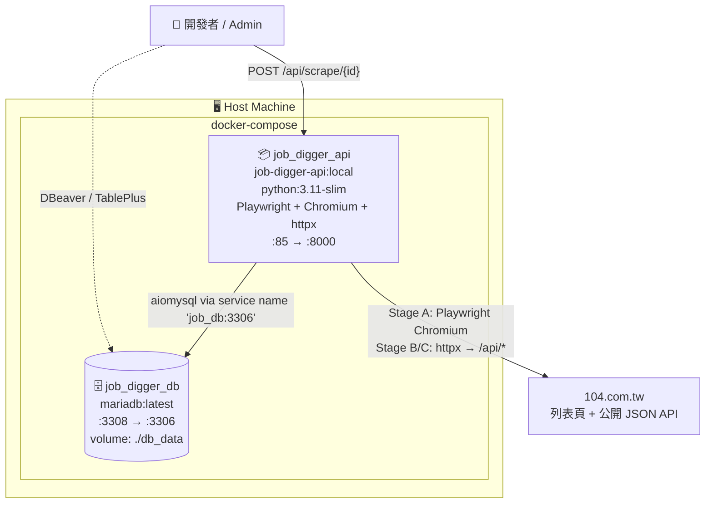

# Deployment View

本文件描述 Job Digger 的**部署單元**(FastAPI + MariaDB)、build 流程、與啟動指令。

目標讀者:**Ops、Architect、想理解「跑起來長什麼樣」的 Reviewer**。

---

## 1. Deployment Diagram



**容器規格**

| 容器 | 角色 | Host Port | Container Port |
|---|---|---|---|
| `job_digger_api` | FastAPI + 三階段爬蟲 + Chromium | **85** | 8000 |
| `job_digger_db` | MariaDB(共用 with admin)| **3308** | 3306 |

> 兩個容器同個 docker-compose,共用一個 default network。`api_box` 透過 service name `job_db:3306` 連 DB(不是走 host)。

---

## 2. 容器規格詳述

### 2.1 `job_digger_api`

| 項目 | 值 | 出處 |
|---|---|---|
| Base image | `python:3.11-slim` | [Dockerfile](../Dockerfile) |
| Build size | ~1.5 GB(含 Chromium ~150 MB)| 第一次 build 5-10 分鐘 |
| 系統依賴 | `wget` `gnupg` `curl`(Playwright 會自己裝 chromium 系統 deps) | Dockerfile |
| Python 套件 | `fastapi` `uvicorn` `playwright` `playwright-stealth` `httpx` `aiomysql` `python-dotenv` | requirements.txt |
| Playwright 安裝 | `playwright install chromium && playwright install-deps chromium`(目前僅 Stage A 使用) | Dockerfile |
| App 模組 | `app.py` + `scraper_vacancies/` + `scpaper_content/` + `scpaper_company/` + `data_transform/` | Dockerfile COPY |
| Entry | `uvicorn app:app --host 0.0.0.0 --port 8000` | Dockerfile CMD |
| Restart policy | `unless-stopped` | docker-compose |

### 2.2 `job_digger_db`

| 項目 | 值 |
|---|---|
| Image | `mariadb:latest` |
| 對外 port | **3308** → 3306(本機 DB IDE 用)|
| Volume | `./db_data:/var/lib/mysql`(bind mount,**重 build 不會清資料**)|
| Init | `./init.sql:/docker-entrypoint-initdb.d/init.sql`(只在第一次起空 DB 時跑)|
| Charset | utf8mb4(裝在 init.sql) |

> ⚠ `db_data` 是 bind mount 到 host(不是 docker volume),好處是直接看得到 DB 檔案;壞處是 host 上必須對該目錄有寫權限。要完全清資料 = `docker compose down && rm -rf db_data`。

---

## 3. 環境變數

完整模板見 [`.env.example`](../.env.example)(若沒有的話本系統的關鍵 env):

| 變數 | 用途 | 預設(dev) |
|---|---|---|
| `DB_ROOT_PASSWORD` | MariaDB root 密碼 | `root_pass_123` |
| `DB_DATABASE` | DB 名稱 | `job_digger` |
| `DB_USERNAME` / `DB_PASSWORD` | 應用連線帳密 | `digger_user` / `digger_pass_456` |
| `DB_HOST` | (容器內)DB host | `job_db`(同 compose service name)|
| `DB_PORT` | DB port | `3306`(容器內)|
| `ALLOWED_ORIGINS` | CORS 白名單 | `http://localhost:84,http://127.0.0.1:84` |
| `BROWSER_HEADLESS` | Playwright 無頭模式(Stage A 用)| `True`(prod)/ `False`(dev 看畫面除錯)|
| `USE_REAL_CHROME` | Stage A 是否用系統 Chrome 而非 bundled Chromium | `false`(容器內沒裝 Chrome) |
| `BLOCK_RESOURCES` | Stage A 是否阻擋 image/font/media + 追蹤 domain(加速)| `true` |
| `STAGE_B_WORKERS` / `STAGE_C_WORKERS` | Stage B/C 並行 worker 數 | `5` |
| `STAGE_B_REQUEST_DELAY` / `STAGE_C_REQUEST_DELAY` | 每 worker 每次 request 後 sleep 秒數 | `0.3` |
| `STAGE_B_TIMEOUT` / `STAGE_C_TIMEOUT` | 單次 API timeout 秒數 | `10` |
| `DEFAULT_KEYWORD` | 沒指定時的 default | `php` |
| `PYTHONUNBUFFERED` | print 即時刷出 | `1` |

> **注意**:`.env` 的 `DB_HOST` 預設是 `127.0.0.1`(本機跑 Python 時用),但 docker-compose 會 override 成 `job_db`(容器內走 service name)。

---

## 4. 啟動 / 停止

### 4.1 第一次跑(會花最久)

```bash
# 0. 確認 .env 存在
cp .env.example .env 2>/dev/null   # 若範本不存在,自己手寫 .env

# 1. up + build(第一次 build ~5-10 分鐘,要裝 Playwright Chromium)
docker compose up -d --build
```

啟動序:
1. **Build builder image**:`pip install` + `playwright install chromium`(~1.5GB)
2. **Start `job_digger_db`**:首次起會 mount `init.sql` 建表
3. **Start `job_digger_api`**:uvicorn 啟動 FastAPI :8000

### 4.2 啟動後驗證

```bash
# Container 狀態
docker ps | grep job_digger

# API alive
curl http://localhost:85/health
# {"status":"ok","port":83}

# Swagger UI(瀏覽器開)
open http://localhost:85/docs
```

### 4.3 觸發第一次爬蟲

```bash
# 看有哪些 search_configs(預設 init.sql 有插一筆 keyword='php')
docker exec -it job_digger_db mariadb -udigger_user -p job_digger \
  -e "SELECT id, keyword, title_tags, content_tags FROM search_configs"

# 觸發
curl -X POST http://localhost:85/api/scrape/1

# 看進度(docker log 印很多)
docker logs -f job_digger_api
```

5-30 分鐘後跑完(視 keyword 抓回多少筆)。

### 4.4 停止 / 清理

```bash
# 停止(留 DB 資料)
docker compose down

# 完全清除(含 DB!⚠ 不可逆)
docker compose down
rm -rf db_data
```

---

## 5. 常用維運指令

```bash
# 進 API 容器(debug)
docker exec -it job_digger_api bash

# 進 DB
docker exec -it job_digger_db mariadb -udigger_user -p job_digger

# 看 API log(背景任務 print 都在這)
docker logs -f job_digger_api

# 看 active tasks(進 container 開 Python REPL)
docker exec -it job_digger_api python -c "from app import active_tasks; print(active_tasks)"

# 查 DB 中的職缺數
docker exec job_digger_db mariadb -udigger_user -p$DB_PASSWORD job_digger \
  -e "SELECT keyword, COUNT(*) FROM vacancies GROUP BY keyword"
```

---

## 6. 健康檢查

| 檢查 | 方式 | 預期 |
|---|---|---|
| API alive | `curl http://localhost:85/health` | `{"status":"ok",...}` |
| DB alive | `docker exec job_digger_db mariadb-admin ping` | `mysqld is alive` |
| Container 沒 OOM | `docker stats job_digger_api` | Memory < 2GB |
| Chromium 沒爆 | `docker exec job_digger_api ps aux \| grep chromium` | 跑爬蟲時有,平時 0 個 |

> 沒有 docker healthcheck 設定(Roadmap)。

---

## 7. 已知部署限制

| 限制 | 影響 | 緩解 |
|---|---|---|
| 第一次 build 久(~10 分鐘 / 1.5GB) | dev 體驗差 | image cache 後 incremental build 30 秒;CI 用 layer cache |
| Chromium 在 alpine 不支援 | 只能用 Debian-based(slim) | 接受 |
| 沒 healthcheck | k8s liveness 沒辦法做 | 加 `HEALTHCHECK CMD curl -f http://localhost:8000/health` |
| 沒 CI build | 每次 push 沒人驗 build | GitHub Actions 加 `docker build .` 步驟 |
| 沒 prod compose | 設定都偏 dev | 加 `docker-compose.prod.yml` overlay,headless = True / log level 提高 |
| 沒 IP 輪換 | 同 IP 跑久會被 ban | proxy pool(Roadmap) |
| Background task 在同 process | API restart 中斷正在跑的爬蟲 | 拆 RQ/Celery worker 容器 |
| `db_data` bind mount | 跨平台權限問題 | prod 改用 docker volume |
| MariaDB 對外 expose 3308 | 攻擊面 | prod 改 `expose: 3306` 不對外,只允許 admin 容器內網連 |
