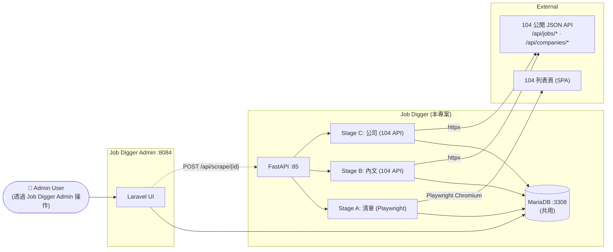

# Project Overview

本文件回答最根本的問題:**Job Digger 是做什麼的?它在整個生態裡扮演什麼角色?**

---

## 1. 系統定位 — 一句話

> **Job Digger 是「104 職缺爬蟲服務」**:吃 keyword + title_tags + content_tags 進去,跑三階段 pipeline(清單 → 內文過濾 → 公司資料補全),把符合條件的職缺存進 MariaDB。提供 HTTP API 給 [Job Digger Admin](../../job_digger_admin) 觸發。
>
> **三 stage 的取資料手段不一樣**:Stage A(清單)用 Playwright 模擬瀏覽器;Stage B(內文)/ Stage C(公司)改打 104 公開 JSON API(見 [ADR-0005](./adr/0005-stage-bc-switch-to-104-api.md)),速度提升一個量級。

它**不**做的事:不渲染 UI、不對 End User 開放、不處理身分驗證(Admin 才管那些)。本系統純粹是 **「爬蟲 service + DB owner」**。

---

## 2. 在生態裡的位置



**關鍵設計**

- **共用 DB**:Admin 跟本系統共用 MariaDB,Admin 寫 search_configs(關鍵字設定)、本系統寫 vacancies(爬回的職缺)
- **生產者-消費者模型**:爬蟲分多階段,用 `asyncio.Queue` 解耦「網頁抓取」跟「DB 寫入」
- **背景任務**:HTTP API 收到觸發後立即回 200,實際爬蟲在 `BackgroundTasks` 跑,不阻塞 caller
- **不直接對外**:CORS 只允許 admin origin,生產環境建議完全不對外 expose port 85

---

## 3. 核心業務概念

| 業務名詞 | 對應實體 | 說明 |
|---|---|---|
| **搜尋配置 (SearchConfig)** | `search_configs` 表 | Admin 設的爬蟲關鍵字 + 過濾標籤 |
| **職缺 (Vacancy)** | `vacancies` 表 | 爬回的 104 職缺,含薪資 / 公司 / 連結 |
| **三階段 Pipeline** | `scraper_vacancies` / `scpaper_content` / `scpaper_company` | A:抓清單(Playwright)→ B:內文比對(API)→ C:公司補資料(API)|

業務流程:
```
Admin 在 UI 設 keyword="PHP", title_tags="php,後端", content_tags="php,laravel"
  ↓
(觸發) POST /api/scrape/1
  ↓
本系統背景跑:
  Stage A — 開 Chromium 進 104,搜 "PHP",抓所有清單頁(Playwright)
  Stage B — 對每筆打 /api/jobs/{no},比對 content_tags 寫 check_type
  Stage C — 對待補公司打 /api/companies/{no}/content,補資本額 / 員工數
  寫進 vacancies 表(UPSERT by job_link)
  ↓
Admin 在 /vacancies/search 看結果
```

---

## 4. Scope — 做什麼,不做什麼

### ✅ In Scope

- **104 資料採集**:Stage A 用 Playwright + Chromium 處理列表 SPA;Stage B/C 用 httpx 直打 104 公開 JSON API
- **三階段 pipeline**:list → content filter → company info
- **多種並發模型**:Stage A 用 `asyncio.Queue` Producer-Consumer;Stage B/C 用 Producer/Worker/Writer + N=5 並行 worker
- **UPSERT 寫入**:`ON DUPLICATE KEY UPDATE job_link`,重跑爬蟲不會重複插入
- **HTTP API**:`POST /api/scrape/{id}` 觸發 + `GET /api/scrape/status/{id}` 查狀態 + `GET /health`
- **DB schema 維護**:`init.sql` 啟動時建 `vacancies` / `search_configs`
- **MariaDB 容器**:同個 docker-compose 內含 DB

### ❌ Out of Scope

- **使用者 UI**:Admin 負責
- **身分驗證**:不開放給外部,所以不必驗(內網 only)
- **Schedule 定時跑**:目前是被動觸發,沒 cron
- **多 site 爬蟲**:只爬 104,不爬 LinkedIn / Indeed 之類
- **AI 篩選**:filter 是純字串比對,不做 NLP / embedding
- **通知**:爬完不會主動通知 Admin(Admin 要自己刷新)

---

## 5. Stakeholders

| Stakeholder | 訴求 | 本系統如何回應 |
|---|---|---|
| **Job Digger Admin** | 一個簡單 HTTP endpoint 觸發爬蟲 | `POST /api/scrape/{id}`,立即回 200 |
| **Admin 使用者(間接)** | 看到準確、新鮮、過濾過的職缺 | 三階段 pipeline 確保資料品質 |
| **104 站(被爬)** | 不要被當成攻擊 | Playwright stealth + 適度延遲 + 單一 keyword 一次性跑完 |
| **Ops** | 長時間穩定跑,不爆記憶體 | Chromium 用完即關,async queue 平衡寫入速度 |

---

## 6. 設計原則

1. **Async first** — `asyncio` + `aiomysql` + Playwright async API,單一 process 處理多個 await
2. **三階段解耦** — 每個階段獨立 module,方便測試 / 替換
3. **生產者-消費者** — 爬取速度跟 DB 寫入速度不必同步,用 queue 緩衝
4. **冪等寫入** — UPSERT 確保「重跑爬蟲只會更新不會重複」
5. **被動觸發** — 不主動跑,等 Admin 觸發,避免被 ops 罵「為什麼 4am 還在抓 104」
6. **Boring tech** — 不引 Redis / Celery / RabbitMQ,FastAPI BackgroundTasks 對單機規模夠了

---

## 7. 非功能需求 (NFR)

> 作品集 / Portfolio 規模,以下是設計時有考量,非壓測通過。

| 類別 | 目標 | 設計回應 |
|---|---|---|
| **吞吐** | 一個 keyword 1k+ 職缺能在 30 分鐘內跑完 | Stage A 用 Producer-Consumer 並發抓清單;Stage B/C 改 API + N=5 並行 worker |
| **記憶體** | 單機 < 1GB(只 Stage A 用 Chromium) | Chromium 用完即關;Stage B/C 純 httpx 不留 in-memory list |
| **DB 寫入安全** | 重跑不重複 | UPSERT (ON DUPLICATE KEY UPDATE job_link) |
| **反爬** | 不被 104 ban | Stage A:Playwright stealth + 末頁探測 hack;Stage B/C:API 端不觸發 CF,但 worker 間 sleep 0.3s 避免 IP 流量集中 |
| **故障隔離** | 一次爬失敗不影響後續 | active_tasks set 追蹤,完成 / 失敗都會 discard;BackgroundTasks 拋例外只記 log 不傳染 |

---

## 8. Glossary

| 術語 | 中文 | 說明 |
|---|---|---|
| **Stage A / B / C** | 三階段 | A=清單採集(Playwright)、B=內文深度過濾(API)、C=公司資訊補全(API)|
| **Producer-Consumer** | 生產者-消費者 | Producer 抓網頁、Consumer 寫 DB,中間用 `asyncio.Queue` 緩衝 |
| **錨點回溯法** | — | 從 `.info-job__text` 元素往上找最近的職缺卡片容器,而非 hardcode XPath |
| **末頁探測 hack** | — | 在跳轉欄位輸入「9999」讓 104 顯示真實末頁,避免 brute-force 翻頁 |
| **UPSERT** | — | `INSERT ... ON DUPLICATE KEY UPDATE`,衝突時更新而非報錯 |
| **BackgroundTasks** | — | FastAPI 內建的「response 回完才跑」機制,適合輕量背景任務 |
| **Playwright Stealth** | — | 改寫 `navigator.webdriver` 等 fingerprint,降低被 detect 為機器人的機率 |
| **ADR** (Architecture Decision Record) | 架構決策紀錄 | 一份決策一份檔,寫「為何選 A 不選 B」 |
