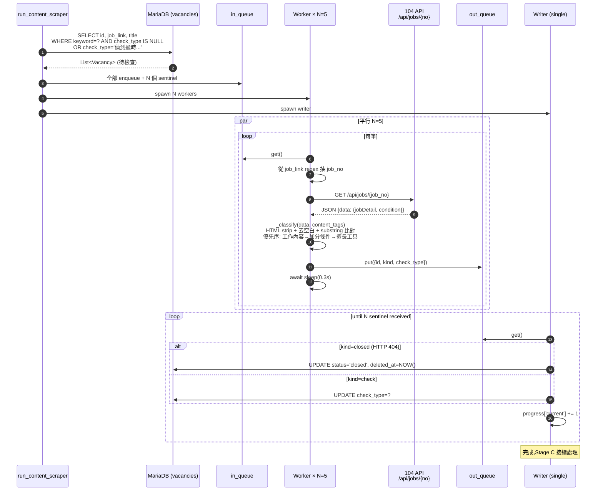
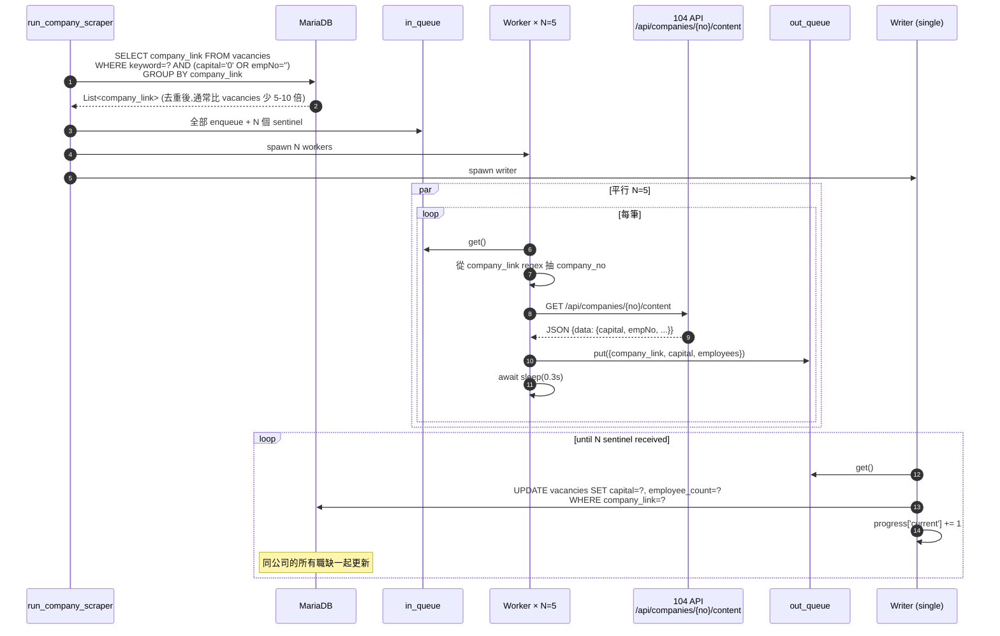
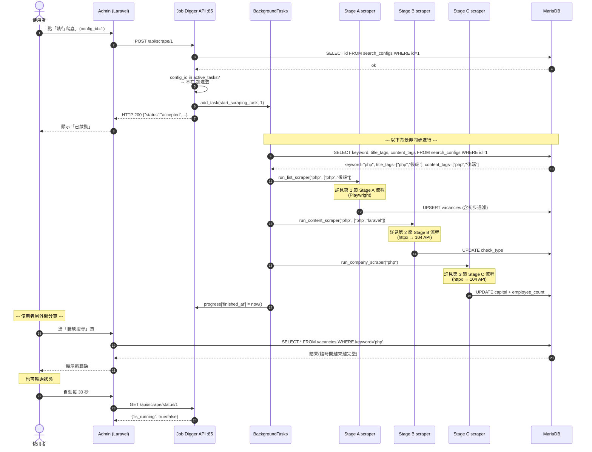

# Sequence Diagrams

本文件用 UML Sequence Diagram + Activity Diagram 描述 Job Digger 的關鍵流程。融合了原 [SA_104_Scraper_Design.md](./legacy/SA_104_Scraper_Design.md) 的內容(已 supersede,保留在 legacy/)。

目標讀者:**SA、開發者、想理解爬蟲怎麼閃避反爬的 Reviewer**。

涵蓋四個流程:

1. Stage A — 清單採集(Producer-Consumer 並發)
2. Stage B — 內文深度過濾
3. Stage C — 公司資料補全(去重訪問)
4. (Roadmap)Admin 觸發 → 整體 pipeline

---

## 1. Stage A — 清單採集(Producer-Consumer)

「最複雜的階段:從輸入 keyword 到所有職缺寫進 DB」

```mermaid
flowchart TD
    Start([開始 Stage A]) --> ReceiveParams[接收參數: keyword, title_tags / content_tags]
    ReceiveParams --> LaunchBrowser[啟動 Playwright Chromium<br/>+ stealth plugin]

    subgraph init["Phase 1: 精準搜尋模擬"]
        LaunchBrowser --> NavigateHome[前往 104 首頁]
        NavigateHome --> WaitLoad{確認頁面 ready}
        WaitLoad --> InputKeyword[輸入 keyword]
        InputKeyword --> OpenCategory[點開職務類別 modal]
        OpenCategory --> SelectIT[選『資訊軟體系統類』]
        SelectIT --> ConfirmCategory[按確定]
        ConfirmCategory --> ExecuteSearch[按搜尋按鈕]
    end

    subgraph hack["Phase 2: 末頁探測 hack"]
        ExecuteSearch --> JumpInput[找跳頁欄位]
        JumpInput --> Type9999[輸入 9999 並 enter]
        Type9999 --> GetLastPage[讀目前頁數 = 真實末頁<br/>(104 自動修正回最大值)]
    end

    subgraph collect["Phase 3: 採集 + 並發 (Producer)"]
        GetLastPage --> ReturnPage1[回到第 1 頁]
        ReturnPage1 --> ScrapingLoop{Loop: page = 1 to LastPage}

        ScrapingLoop -- 執行中 --> ScrollDown[捲動到底觸發 lazy-load]
        ScrollDown --> JsExtract[page.evaluate JS 批次抽:<br/>title, company, job_link, salary]
        JsExtract --> AnchorTrace[錨點回溯:<br/>從 .info-job__text 找父 card]
        AnchorTrace --> FilterTitle{標題含<br/>title_tags / content_tags 任一?}
        FilterTitle -- 是 --> EnqueueData[放進 asyncio.Queue]
        FilterTitle -- 否 --> NextPage
        EnqueueData --> NextPage[點下一頁]
        NextPage --> ScrapingLoop
        ScrapingLoop -- done --> SignalEnd[Queue.put None  終止信號]
    end

    subgraph consume["Phase 4: Consumer (3 個並行)"]
        SignalEnd --> WorkerLoop{3 個 Worker 並行 Loop}
        WorkerLoop --> GetItem[Queue.get item]
        GetItem -- None --> EndWorker[結束]
        GetItem -- 有資料 --> Upsert[UPSERT vacancies<br/>ON DUPLICATE KEY UPDATE job_link]
        Upsert --> WorkerLoop
    end

    EndWorker --> Done([Stage A 結束])
```

**關鍵設計**

| 點 | 為什麼 |
|---|---|
| **Stealth plugin** | 改寫 `navigator.webdriver` 等 fingerprint,降低被當機器人擋的機率 |
| **末頁探測 hack(輸入 9999)** | 104 收到超範圍頁碼會自動修正回末頁,瞬間知道任務終點;比 brute-force 翻直到 404 快 100 倍 |
| **錨點回溯** | 從 `.info-job__text` 往上找最近的職缺卡片,而非 hardcode XPath。104 改版時容錯性高 |
| **第一道過濾在 Producer** | 標題不符的根本不進 queue,減少 60-80% 寫入量 |
| **None 作為終止信號** | Producer 跑完丟 N 個 None(N = worker 數),Worker 收到就結束。標準 producer-consumer pattern |

---

## 2. Stage B — 內文深度過濾(104 API)

「Stage A 用標題過濾過了,為什麼還要 Stage B?」

因為標題常有「軟體工程師(Backend)」這種模糊命名,標題過了但內文要求其實是 .NET 不是 PHP。Stage B 用 **104 公開 API** 取內文做更精確的判斷(見 [ADR-0005](./adr/0005-stage-bc-switch-to-104-api.md))。



**API 欄位對應**:

| 寫進 DB 的 check_type | 對應 API 路徑 |
|---|---|
| `工作內容有含關鍵字` | `data.jobDetail.jobDescription` |
| `加分條件或必要條件內有含關鍵字` | `data.condition.other` |
| `僅有擅長工具含關鍵字,建議確認後再進行履歷投遞` | `data.condition.specialty[].description`(陣列串接)|
| `no_match` | 三者都沒中 |

**重點**:
- **不刪除不通過的紀錄**:標 `check_type` 即可(包含 `no_match`),保留 audit trail
- **HTML 處理**:`data.jobDetail.jobDescription` 是 HTML 字串(含 `<br>` `<p>` 等),比對前先 `_strip_html` + `html.unescape`
- **比對邏輯與舊版完全相容**:`check_type` 字串沒變,admin UI 與 SQL 都不需要動

---

## 3. Stage C — 公司資料補全(104 API + 去重訪問)

「補資本額 / 員工數,用 104 公開 API 取代瀏覽器訪問」



**設計重點**

| 點 | 為什麼 |
|---|---|
| **去重 (GROUP BY company_link)** | 100 個職缺可能屬於 20 家公司,不去重會白白多打 5 倍 API |
| **只補空的** (`capital='0' OR employee_count=''`) | 第二次跑爬蟲時,已補的不再重補 |
| **批次 UPDATE WHERE company_link=?** | 同公司多個職缺一起更新,不是 N+1 |
| **API 回傳的字串格式跟原本頁面抽取完全一致** | `"6000萬元"` / `"16人"`,DB 不會混兩種格式 |
| **HTTP 404 → 寫 default** | 公司下架時寫 `capital='0'`,避免下次又被 SELECT 撈到無限重試(現有小毛病,可接受)|

---

## 4. Admin 觸發 → 整體 pipeline

「使用者按下 Admin 的『執行爬蟲』按鈕,完整跨系統時序」



---

## 5. 反爬策略總覽

把分散在各 Stage 的反爬手段整合在一起:

| 手段 | 在哪實作 | 對抗什麼 |
|---|---|---|
| Playwright Stealth | Stage A | navigator.webdriver / plugins / languages 等 fingerprint 偵測 |
| 模擬人類點擊(input → click → wait)| Stage A 搜尋部分 | 偵測「直接 navigate 帶 query string」這種 bot 行為 |
| 末頁探測 hack(避免 brute-force 翻頁)| Stage A | 短時間內大量翻頁的 rate-based 偵測 |
| Resource blocker(擋 image/font/media + 追蹤 domain)| Stage A | 加速 + 降流量,間接降低被偵測機率 |
| 公司頁去重(GROUP BY company_link)| Stage C | 同 IP 短時間重複請求同 endpoint |
| 第一道過濾在 Producer | Stage A | 不寫入「假興趣」職缺,間接降低 DB 壓力 |
| Worker 間 sleep 0.3s | Stage B/C | API 端 rate limit,雖然門檻寬但仍避免流量集中 |
| 退避重試(403/429 等 30 秒)| Stage B/C | 暫時被擋時不直接放棄 |

**沒做但建議的**(對應 [adr/0002-playwright-vs-requests.md](./adr/0002-playwright-vs-requests.md) 的 Roadmap):
- IP rotation(proxy pool)
- User-Agent 輪換
- 隨機延遲(目前是固定的 page wait)
- Captcha 處理(目前 104 沒主動跳,但可能會)

---

## 6. 失敗處理

```mermaid
flowchart LR
    start([Stage A/B/C 任一執行])
    do[執行...]
    ok{成功?}
    success([下一階段])

    catch[try/except 捕捉]
    log[print 到 docker log]
    discard[active_tasks.discard]
    end_task([任務終止,但不影響其他]）

    start --> do --> ok
    ok -- 是 --> success
    ok -- 否 --> catch --> log --> discard --> end_task
```

**目前的限制**:
- **沒重試**:Stage 中斷就放棄整個 task(對應 [adr/0001 Roadmap](./adr/0001-fastapi-vs-django.md))
- **沒部分成功**:即使 Stage A 跑完 90%,Stage B/C fail 一樣算整個 task fail(但 A 寫的 vacancies 還在 DB)
- **錯誤回報只在 docker log**:Admin 不會收到通知,要自己看 log

對「我自己用」是 OK 的(出問題我會看 log),要對外開放才需要補 retry / observability。
