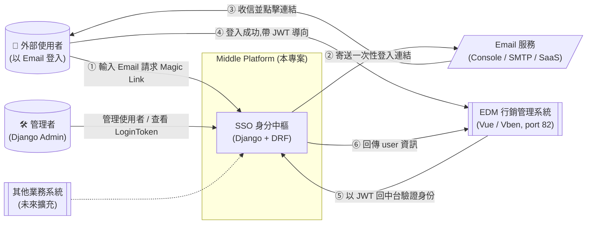
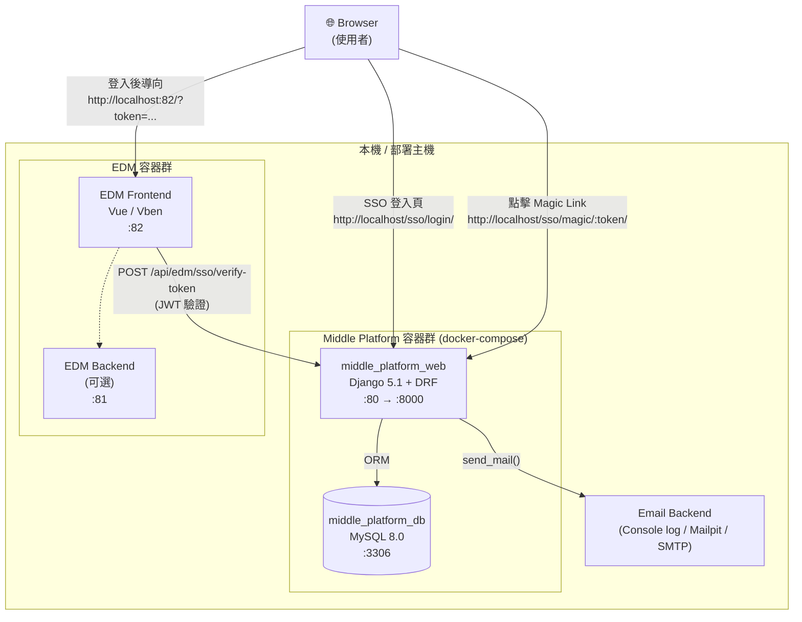
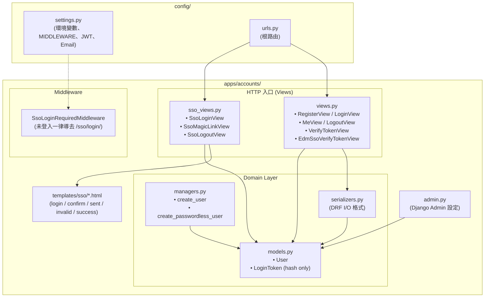
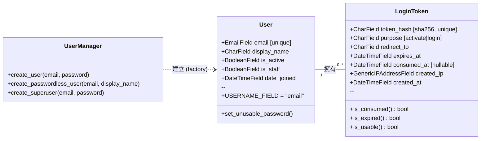
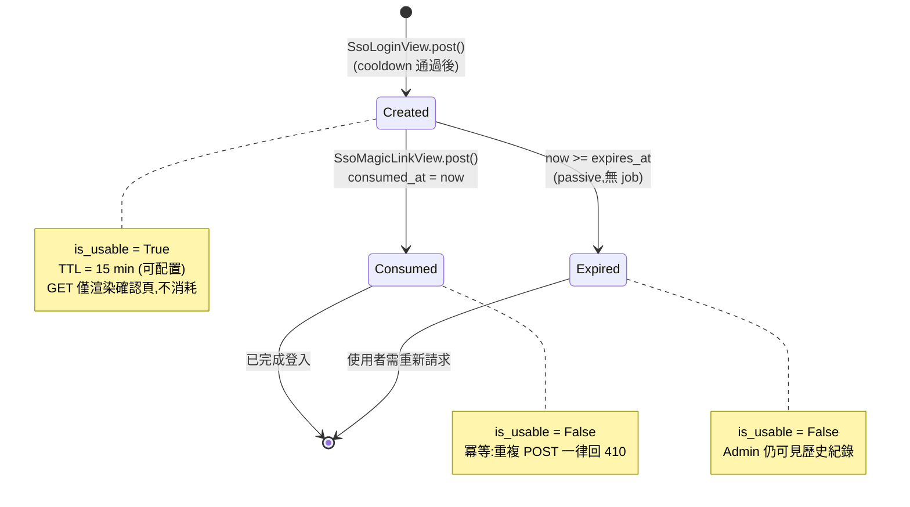
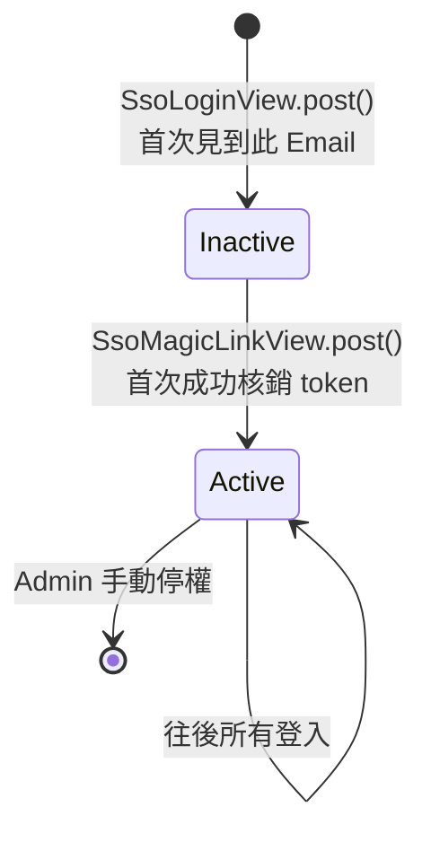

# 系統架構圖

本文件描述 Middle Platform 在整體系統中的定位,以及開發者視角下的模組組成。
採用 C4 Model 的前兩層(Context / Container)並以 Mermaid 繪製,GitHub 可直接渲染。

---

## Level 1 — System Context(系統脈絡)

「這個系統服務誰、又依賴誰?」

**重點**
- Middle Platform **只負責身分識別**,不存業務資料。
- 各業務系統(EDM、未來新站)自帶 DB,只會回中台做 **token 驗證**。
- Email 服務為可抽換元件:開發用 Console Backend,Demo 可接 Mailpit,Prod 接 SES / SendGrid / Mailgun。

---

## Level 2 — Container Diagram(容器/服務組成)

「把系統打開來看,裡面有哪些獨立部署單元?」

**各容器責任**

| 容器 | 角色 | 核心職責 |
|---|---|---|
| `middle_platform_web` | 身分中樞 | SSO 登入頁、Magic Link 簽發/核銷、JWT 簽發與驗證、Django Admin |
| `middle_platform_db` | 資料儲存 | `accounts_user`、`accounts_login_token`、SimpleJWT 黑名單表 |
| `EDM Frontend` | 業務前台 | 接收 `?token=...`,呼叫中台 verify 後載入 dashboard |
| `Email Backend` | 訊息傳遞 | 把 Magic Link 送到使用者信箱(介面可替換) |

---

## Level 3 — Middle Platform 內部模組(Django App 視角)

「web 容器裡面,程式碼是怎麼分層的?」

**分層說明**
- **HTTP 入口**:`sso_views.py` 服務瀏覽器端(渲染 HTML);`views.py` 服務程式端(回 JSON)。
- **Middleware**:所有未登入流量在進入 View 前就會被攔下導去 `/sso/login/`,白名單見 `settings.SSO_LOGIN_EXEMPT_PREFIXES`。
- **Domain**:Model 只存原始資料,`LoginToken` 永遠只存 sha256 hash,原始 token 只存在寄出的 Email 裡。
- **Template**:所有 SSO 頁面都在 `templates/sso/`,便於未來抽換設計系統。

---

## Level 4 — Class Diagram(Domain Model)

「在 DB 裡,資料是怎麼被描述的?」

**設計要點**
- `User` 以 **email 為唯一識別**(`USERNAME_FIELD = "email"`),不使用 username。
- Passwordless 帳號由 `UserManager.create_passwordless_user()` 建立,會呼叫 `set_unusable_password()` 寫入一個**不可能 hash 回對應的密碼值**,從根本免疫撞庫與弱密碼攻擊。
- `LoginToken.token_hash` 永遠是 sha256,**原始 token 不進 DB**。DB 外洩也無法登入。
- `LoginToken` 三個 `@property`(`is_consumed` / `is_expired` / `is_usable`)是 domain logic 的單一來源,view 與 admin 都依賴它判斷可用性,避免邏輯散落。

---

## Level 5 — State Diagram(LoginToken 生命週期)

「一張 Magic Link 從生到死會經歷哪些狀態?」

**狀態轉換規則**
- **Created → Consumed**:僅 `POST /sso/magic/<token>/` 會觸發。**GET 不轉移狀態**,這是對抗 Email 安全掃描器預抓的核心設計。
- **Created → Expired**:被動判定,沒有 cron job 主動標記。任何讀取時透過 `is_expired` property 即時計算(`now >= expires_at`)。
- **終止狀態**:Consumed 與 Expired 都是 terminal,不會再變。Admin 保留紀錄作為稽核用途(誰、何時、從哪個 IP 發起登入)。

附帶的 `User.is_active` 也有極簡的生命週期:

> 「輸入 Email=建立帳號」的語意讓註冊與登入合而為一,但**未完成首次 magic link 驗證的帳號仍是 Inactive**,無法登入任何業務系統。這避免了有人用別人 Email 到處建立假帳號的騷擾。

---

## 資料流(登入一次的生命週期)

1. **使用者點 EDM** → EDM 發現沒 token → 導到 `/sso/login/?redirect=http://localhost:82/`
2. **中台 SSO 登入頁** 收到 email → 建立/找到 User → 產 raw token → 存 sha256 hash 進 DB → 寄 Email
3. **使用者在信箱點連結** `/sso/magic/<raw_token>/` → GET 顯示「確認登入」頁(防 Email 掃描器預抓)
4. **使用者按「繼續登入」** → POST 相同 URL → 中台核銷 token、啟用帳號、簽 JWT、導回 EDM 並夾帶 `?token=...`
5. **EDM 收到 token** → POST `/api/edm/sso/verify-token` → 中台驗 JWT、回 userInfo → EDM 進入 dashboard

完整對話請見 [`docs/user-flow.md`](./user-flow.md) 的 Sequence Diagram。
