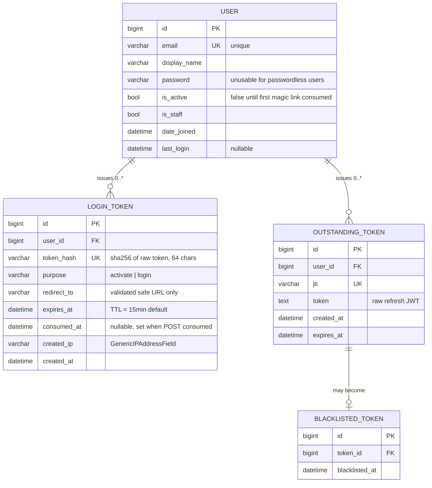

# Data Model

本文件描述 Middle Platform 在 MySQL 中的資料結構,目標讀者:**開發者、DBA、想理解持久化設計的 Reviewer**。

> 跟 [`architecture.md` Level 4](./architecture.md#level-4--class-diagrammodel) 的 Class Diagram 互補:Class Diagram 從 OOP 視角描述 domain object 的方法與行為,本文件從 DB schema 視角描述「資料怎麼落地」。

---

## 1. ERD (Entity Relationship Diagram)



**圖例**
- `||--o{` = 一對多
- `||--o|` = 一對 0~1
- `PK` 主鍵 / `FK` 外鍵 / `UK` 唯一鍵

---

## 2. 表清單

| 表 | 來源 | 用途 | 是否可讀(機敏度) |
|---|---|---|---|
| `accounts_user` | 本專案 | 使用者主表 | 中(含 email) |
| `accounts_login_token` | 本專案 | Magic Link 雜湊紀錄 | **高**(雖只存 hash,但仍是登入相關) |
| `token_blacklist_outstandingtoken` | SimpleJWT | 已簽發未過期的 refresh token | 高 |
| `token_blacklist_blacklistedtoken` | SimpleJWT | 已失效的 refresh token | 中 |
| `auth_*` / `django_*` | Django 內建 | Permission / Session / Admin Log / Migration | 低 |

> 後三類為 Django / SimpleJWT 內建,本文件聚焦於本專案自定義的兩張表 + SimpleJWT 兩張表(因設計上會用到)。

---

## 3. 表結構詳述

### 3.1 `accounts_user`

```sql
CREATE TABLE accounts_user (
    id            BIGINT       PRIMARY KEY AUTO_INCREMENT,
    password      VARCHAR(128) NOT NULL,
    last_login    DATETIME     NULL,
    is_superuser  TINYINT(1)   NOT NULL DEFAULT 0,
    email         VARCHAR(254) NOT NULL UNIQUE,
    display_name  VARCHAR(150) NOT NULL DEFAULT '',
    is_active     TINYINT(1)   NOT NULL DEFAULT 1,
    is_staff      TINYINT(1)   NOT NULL DEFAULT 0,
    date_joined   DATETIME     NOT NULL,
    UNIQUE KEY uniq_email (email)
);
```

**欄位重點**

| 欄位 | 設計考量 |
|---|---|
| `email` | **Username field**(`USERNAME_FIELD = "email"`),取代 Django 預設的 `username`。Unique 索引保證可以拿 email 直查 |
| `password` | 對 passwordless user 由 `set_unusable_password()` 寫入「以 `!` 開頭的不可雜湊回字串」,API 端永遠 `check_password` 失敗 |
| `is_active` | **首次建立時為 `False`**(由 `create_passwordless_user` 控制),消耗 magic link 後才轉為 `True`。詳見 [architecture.md State Diagram](./architecture.md#level-5--state-diagramlogintoken-生命週期) |
| `is_staff` | 控制能否登入 Django Admin。預設 `False` |
| `display_name` | 寫入 JWT claim 用,沒有時 fallback 為 email 的 `@` 之前 |

### 3.2 `accounts_login_token`

```sql
CREATE TABLE accounts_login_token (
    id           BIGINT       PRIMARY KEY AUTO_INCREMENT,
    user_id      BIGINT       NOT NULL,
    token_hash   VARCHAR(64)  NOT NULL UNIQUE,
    purpose      VARCHAR(16)  NOT NULL,
    redirect_to  VARCHAR(512) NOT NULL DEFAULT '',
    expires_at   DATETIME     NOT NULL,
    consumed_at  DATETIME     NULL,
    created_ip   VARCHAR(39)  NULL,
    created_at   DATETIME     NOT NULL,
    UNIQUE KEY uniq_token_hash (token_hash),
    KEY idx_user_created (user_id, created_at DESC),
    CONSTRAINT fk_login_token_user
        FOREIGN KEY (user_id) REFERENCES accounts_user(id) ON DELETE CASCADE
);
```

**安全核心 — 為什麼欄位這樣設計**

| 欄位 | 設計考量 | 對應 ADR |
|---|---|---|
| `token_hash` | 永遠是 sha256 hex(64 chars),**原始 token 永不入庫**。即使 DB 整批外洩,攻擊者也無法用 hash 反推原 token 登入 | [ADR-0003](./adr/0003-token-hash-only.md) |
| `purpose` | 區分 `activate`(首次啟用)與 `login`(已啟用後再次登入),便於後續做不同 TTL / rate limit 策略 | — |
| `redirect_to` | 由 `_is_safe_redirect()` 驗證後才寫入(只允許白名單 host),防 Open Redirect 攻擊 | — |
| `expires_at` | 設定時即決定,讀取時被動判斷(無 cron job 主動清理),邏輯集中在 `is_expired` property | — |
| `consumed_at` | `null` = 尚未使用;有值 = 已用過。唯一的「狀態變更欄位」,由 `SsoMagicLinkView.post()` 寫入 | — |
| `created_ip` | 稽核用。可在 Admin 查「某 email 從哪些 IP 請求過 magic link」,協助偵測異常 | — |
| `idx_user_created` | 複合索引,加速「查某 user 最近的 token」(用於 cooldown 判斷) | — |
| `ON DELETE CASCADE` | 刪 user 時連帶刪 token,避免遺孤紀錄 | — |

**Domain logic 落在 `@property`**,不在 DB 觸發器:

| Property | 等效查詢 |
|---|---|
| `is_consumed` | `consumed_at IS NOT NULL` |
| `is_expired` | `NOW() >= expires_at` |
| `is_usable` | `NOT is_consumed AND NOT is_expired` |

> **為什麼不在 DB 加 `status` 欄位?**
> 狀態是「衍生資料」,可從 `consumed_at + expires_at + now()` 推導。多存一個 `status` 欄位會引入「實際時間過期但 status 還沒被 job 標記」的不一致風險。當下計算最簡單也最正確。

### 3.3 SimpleJWT — `token_blacklist_*`

由 `rest_framework_simplejwt.token_blacklist` 提供,本專案沒有自定義,引用主要是因為:

- 開啟 `ROTATE_REFRESH_TOKENS = True` 時,每次 refresh 會發新的、舊的進黑名單
- 開啟 `BLACKLIST_AFTER_ROTATION = True` 時,被 rotate 掉的 refresh token 立即失效
- `LogoutView` 主動把 refresh token 加入黑名單

| 表 | 用途 |
|---|---|
| `token_blacklist_outstandingtoken` | 所有已簽發但**仍在效期內**的 refresh token(每次 issue 一筆) |
| `token_blacklist_blacklistedtoken` | 上表中**已被撤銷**的 refresh token(logout 或 rotation 時 insert) |

**驗證流程**:`JWTAuthentication` 解析 token 時,會 query `blacklisted` 表確認該 jti 不在裡面。

---

## 4. 資料生命週期

### 4.1 一個使用者的生命線

```
首次輸入 Email
   │
   ▼
[accounts_user 新增一筆]
  is_active = False
  password = "!隨機亂數"  ← 永遠驗不過
   │
   ▼ (等使用者點 magic link)
[accounts_user UPDATE]
  is_active = True
   │
   ▼ (登入後簽發 access + refresh)
[token_blacklist_outstandingtoken 新增一筆]
  jti = ..., expires_at = +7d
   │
   ▼ (logout 或 refresh rotation)
[token_blacklist_blacklistedtoken 新增一筆]
  指向 outstanding 那筆
```

### 4.2 一張 Magic Link 的生命線

詳見 [architecture.md Level 5 — State Diagram](./architecture.md#level-5--state-diagramlogintoken-生命週期)。

---

## 5. 索引與查詢規劃

| 主要查詢 | 命中索引 | 出處 |
|---|---|---|
| 用 email 找 user(登入時) | `uniq_email` | `User.objects.get(email=...)` |
| 用 raw token 找 LoginToken | `uniq_token_hash` | `get_object_or_404(LoginToken, token_hash=_hash_token(raw))` |
| 查某 user 最近的 token(cooldown) | `idx_user_created` | `LoginToken.objects.filter(user=..., created_at__gte=...).exists()` |
| Admin 列出某 user 的所有 token | `idx_user_created`(reverse 排序天然友好) | Django Admin |

> 目前資料量不大(作品集 / Portfolio 場景),這些索引已涵蓋熱點查詢。若未來規模放大,可加入 `idx_consumed_expires (consumed_at, expires_at)` 加速「查可用 token」這類分析查詢。

---

## 6. 資料保留政策(Roadmap)

目前**沒有**自動清理機制 — 已用過 / 已過期的 LoginToken 會永久保存在 DB,作為稽核紀錄。

**未來建議**(視場景而定):

| 表 | 保留期 | 清理方式 |
|---|---|---|
| `accounts_login_token` | 90 天 | 排程 job 刪 `consumed_at < now-90d OR expires_at < now-90d` |
| `token_blacklist_outstandingtoken` | 過期即可清 | SimpleJWT 內建 `flushexpiredtokens` management command |
| `token_blacklist_blacklistedtoken` | 同上 | 同上 |

對應 management command 範例:
```bash
docker compose exec web python manage.py flushexpiredtokens
```
