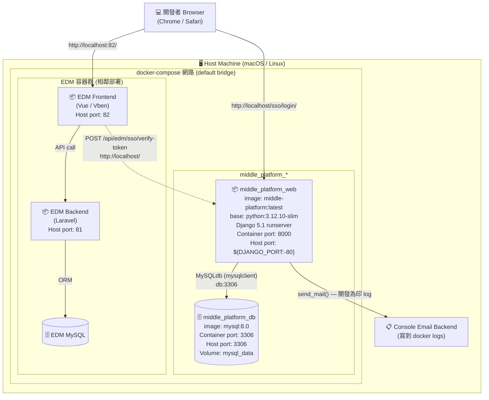
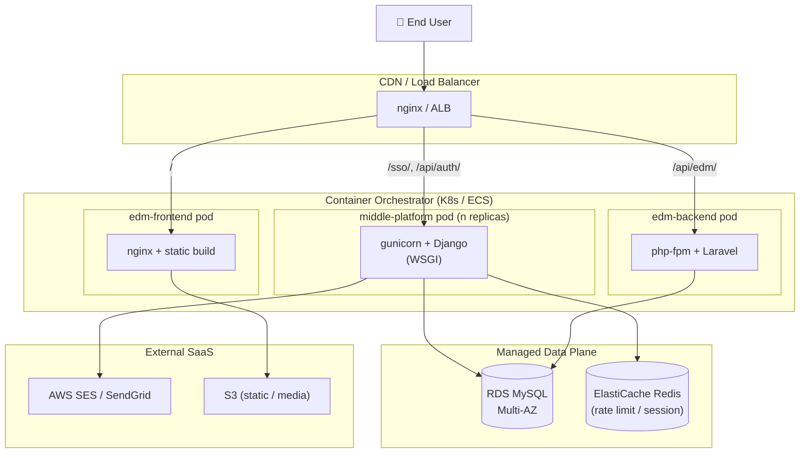

# Deployment View

本文件描述 Middle Platform 的**部署單元**(容器)、它們之間的網路關係,以及如何在本機與類正式環境啟動。

目標讀者:**Ops、Architect、想理解「跑起來長什麼樣」的 Reviewer**。

---

## 1. Deployment Diagram

### 1.1 開發環境(本機 Docker)



**重點:三個 Compose,鄰居關係**

中台、EDM 前端、EDM 後端各有自己的 `docker-compose.yml`,**獨立啟動、獨立關閉**,但都掛在 host 的 default bridge network,互相用 `localhost:port` 訪問。

> 為何不放同一個 compose?**獨立性**:三個系統的 ownership 不同,生命週期也不同(改中台不應該重啟 EDM)。生產環境的對應做法是不同的 K8s Namespace 或不同的 ECS Service。

### 1.2 假設的 Production Topology(Roadmap,未實作)



> 此圖是**設計意圖**,實際部署檔案目前未提供。列出來的目的是讓 reviewer 知道架構 ready for production(無狀態、外部 DB、外部 cache、外部 mail)。

---

## 2. 容器規格

### 2.1 `middle_platform_web`

| 項目 | 值 | 出處 |
|---|---|---|
| Base image | `python:3.12.10-slim` | [`Dockerfile:1`](../Dockerfile) |
| App entry | `python manage.py runserver 0.0.0.0:8000` | [`docker-compose.yml`](../docker-compose.yml) |
| 對外 port | `${DJANGO_PORT:-80}` → container `8000` | 同上 |
| Volume | `./:/app` (bind mount,**dev only**,程式碼即時同步) | 同上 |
| 系統依賴 | `default-libmysqlclient-dev`、`pkg-config`、`build-essential` | [`Dockerfile:8-14`](../Dockerfile) |
| Python 依賴 | [`requirements.txt`](../requirements.txt) |
| 啟動依賴 | `db: service_healthy` | docker-compose `depends_on` |
| Restart policy | `unless-stopped` | docker-compose |

**生產調整建議**(目前是 dev 設定):
- `runserver` → `gunicorn config.wsgi:application --workers 4`
- 移除 `volumes: - .:/app`,改用 `COPY` 進 image
- 啟動時跑 `python manage.py collectstatic --noinput`,前面接 nginx 服務 static

### 2.2 `middle_platform_db`

| 項目 | 值 |
|---|---|
| Image | `mysql:8.0` |
| 對外 port | `3306` |
| Volume | `mysql_data` (named volume,**保留 DB 資料**) |
| Init script | `./docker-compose/mysql/init.sql` 掛到 `/docker-entrypoint-initdb.d/` |
| Charset | `utf8mb4` / `utf8mb4_unicode_ci` |
| Healthcheck | `mysqladmin ping`,interval 10s,5 retries |

> ⚠ Bind 對外 `3306` 方便本機用 DBeaver / TablePlus 連入,**正式環境不可這樣做**(DB 必須在私有網段)。

---

## 3. 環境變數與設定來源

```
.env (host)              ← 開發者編輯
   │
   │ docker-compose.yml: env_file: .env
   ▼
container 環境變數
   │
   │ Django 啟動時 environ.Env.read_env()
   ▼
config/settings.py 各 env(...) 讀取
```

**所有可調設定**(完整清單見 [`README.md` 環境變數](../README.md#環境變數)):

| 類別 | 範例 | 容器啟動時讀? | 改動後需要 |
|---|---|---|---|
| Django core | `DJANGO_SECRET_KEY`、`DJANGO_DEBUG` | ✅ | `restart` |
| DB 連線 | `DB_HOST`、`DB_USERNAME`、`DB_PASSWORD` | ✅ | `restart`(連線池會重建) |
| JWT | `JWT_ACCESS_TOKEN_LIFETIME_MIN`、`JWT_REFRESH_TOKEN_LIFETIME_DAYS` | ✅ | `restart` |
| Magic Link | `MAGIC_LINK_TTL_MINUTES`、`MAGIC_LINK_RESEND_COOLDOWN_SECONDS` | ✅ | `restart` |
| EDM 整合 | `EDM_URL`、`EDM_LANDING_PATH` | ✅ | `restart` |
| Job Digger Admin 整合 | `JOB_DIGGER_ADMIN_URL`、`JOB_DIGGER_ADMIN_LANDING_PATH` | ✅ | `restart` |
| Email | `EMAIL_BACKEND`、`DEFAULT_FROM_EMAIL` | ✅ | `restart` |

**改 code 不用 restart**,因為 dev 設定的 `runserver` 會自動 reload(volumes mount 讓 host 改動即時同步進 container)。

---

## 4. 網路與 Port 對外

| 服務 | Host port | Container port | 用途 |
|---|---|---|---|
| Middle Platform Web | `${DJANGO_PORT:-80}` | `8000` | SSO 登入頁、API |
| Middle Platform DB | `3306` | `3306` | 開發者本機連 DB(正式環境應移除) |
| EDM Frontend | `82` | (依 EDM compose) | 業務前端 |
| EDM Backend | `81` | (依 EDM compose) | 業務後端 API |

**DNS / Service Discovery(本機)**:
- Compose 內部:用 service name(中台容器內 `db:3306` = MySQL 容器)
- 跨 Compose:目前用 `localhost:<port>`,所有容器跑在同一台 host 才行
- 跨主機(Roadmap):需引入 reverse proxy(nginx / Traefik)+ DNS

---

## 5. 啟動 / 停止 / 重置

```bash
# 一般啟動(背景)
docker compose up -d

# 看 log
docker compose logs -f web

# 重啟單一服務(改 .env / settings.py 後)
docker compose restart web

# rebuild image(改 Dockerfile / requirements.txt 後)
docker compose build web && docker compose up -d

# 停止但保留資料
docker compose down

# 完全清空(含 DB 資料)— ⚠ 不可逆
docker compose down -v
```

**Migration**(改 model 後):
```bash
docker compose exec web python manage.py makemigrations
docker compose exec web python manage.py migrate
```

> 容器啟動 command 已自動跑 `migrate`(見 [`docker-compose.yml`](../docker-compose.yml) `command:`),所以一般情況不用手動 migrate。手動執行的場景:剛改完 model,還沒 commit,要先測試。

---

## 6. 健康檢查

| 檢查 | 方式 | 預期回應 |
|---|---|---|
| MySQL 是否就緒 | `mysqladmin ping` | docker-compose healthcheck 自動跑 |
| Web 是否就緒 | `curl http://localhost/api/health/` | `{"status": "ok"}` |
| 是否能簽 JWT | `curl -X POST http://localhost/api/auth/login/ -d '{"email":"...","password":"..."}'` | 回 `{"access": "...", "refresh": "..."}` |

> 目前**沒有** Web 容器的 healthcheck(只有 DB 有),屬於 Roadmap 項目。建議加 `HEALTHCHECK CMD curl --fail http://localhost:8000/api/health/ || exit 1` 到 Dockerfile。

---

## 7. 已知部署限制

| 限制 | 影響 | 緩解 |
|---|---|---|
| 用 `runserver`(非 gunicorn) | 不能上 production,無 worker 控制 | 切換到 `gunicorn`,調 worker 數 |
| 程式碼 bind mount | image 跟 host 耦合,無法搬到別台 | 改 `COPY . /app`,build 完整 image |
| MySQL 對外 expose 3306 | 攻擊面 | 正式環境刪除 ports mapping,僅內網訪問 |
| 無 reverse proxy | 全部直連 Django | 加 nginx / Traefik 處理 TLS、static、rate limit |
| 無 healthcheck | K8s liveness/readiness 沒辦法做 | 補 healthcheck endpoint(已有 `/api/health/` 但未掛 docker healthcheck) |
| 預設 `DJANGO_DEBUG=True`(範例 .env) | Production 開啟會洩漏 stack trace | 部署時必須改成 `False` |
