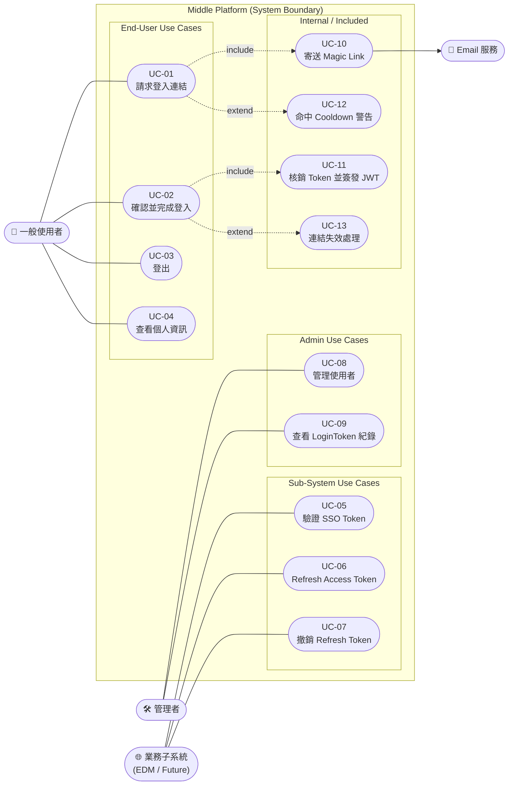

# Use Case Diagram

本文件描述 Middle Platform 的**角色(Actor)**與他們能在系統裡做的事(Use Case),提供一張給開發者與審查者快速對齊需求範圍的圖。

---

## 1. Actors

| Actor | 類型 | 說明 |
|---|---|---|
| 👤 **一般使用者** | Primary | 以 Email 登入中台,最終進入業務系統 |
| 🛠 **管理者** | Primary | 在 Django Admin 管理使用者與登入紀錄 |
| 🌐 **業務子系統** | Primary | EDM 或未來新接入系統,以 JWT 與中台互動 |
| 📧 **Email 服務** | Supporting | 被動接收中台的 `send_mail()`,將 Magic Link 送達使用者 |

> 一般使用者與業務子系統皆為 Primary Actor:前者透過瀏覽器直接面對中台,後者透過 API 間接面對中台,兩者觸發的 Use Case 互相獨立。

---

## 2. Use Case Diagram

> Mermaid 原生不支援 UML Use Case 的橢圓符號,此處以 rounded rectangle 表示 Use Case、stadium 表示 Actor,並以 `include` / `extend` 虛線箭頭標示關聯,語意與 UML 等價。

---

## 3. Use Case 規格

### UC-01 請求登入連結
- **Actor**:一般使用者
- **前置條件**:無(未登入亦可)
- **主流程**:
  1. 使用者打開 `/sso/login/?redirect=<業務系統 URL>`
  2. 輸入 Email → 送出
  3. 系統尋找或建立 User(首次登入自動註冊,`is_active=False`)
  4. «include» UC-10 寄送 Magic Link
  5. 顯示「請查收信箱」頁
- **替代流程(extend)**:
  - **E1 Cooldown**:60 秒內曾請求過 → UC-12,頁面附帶「請稍後再試」提示(仍顯示同一頁)
  - **E2 Email 格式錯誤**:回 400 並顯示錯誤訊息

### UC-02 確認並完成登入
- **Actor**:一般使用者
- **前置條件**:使用者已收到 Magic Link 信件
- **主流程**:
  1. 使用者點擊 Email 中連結 → `GET /sso/magic/<token>/`
  2. 系統驗證 token `is_usable` → 顯示「確認登入」頁(**非直接消耗**,防 Email 掃描器預抓)
  3. 使用者按「繼續登入」→ `POST /sso/magic/<token>/`
  4. «include» UC-11 核銷 Token 並簽發 JWT
  5. 302 redirect 回業務系統並夾帶 `?token=<jwt>`
- **替代流程(extend)**:
  - **E1 連結失效**:token 已過期或已被消耗 → UC-13,回 410 並引導重新請求
  - **E2 redirect_to 不在白名單**:渲染中台本地成功頁(`sso/login_success.html`)而非外部導向

### UC-03 登出
- **Actor**:一般使用者
- **主流程**:
  1. 使用者打開 `/sso/logout/`
  2. 系統清除 session cookie(`django.contrib.auth.logout`)
  3. 若帶有安全 `redirect` 則導回,否則導到 `/sso/login/`

### UC-04 查看個人資訊
- **Actor**:一般使用者(已登入)
- **主流程**:`GET /api/auth/me/`(需 JWT)→ 回傳 email / display_name 等基本資訊

### UC-05 驗證 SSO Token
- **Actor**:業務子系統
- **前置條件**:子系統從 redirect 收到 `?token=<jwt>`
- **主流程**:
  1. 子系統 `POST /api/edm/sso/verify-token` 帶上 token
  2. 中台 `JWTAuthentication.get_validated_token()` 驗簽與 TTL
  3. 回傳 `{code:0, data:{accessToken, userInfo}}`(Vben 格式)
- **失敗流程**:token 無效 / 過期 → 回非 0 的 code,子系統自行導回中台登入

### UC-06 Refresh Access Token
- **Actor**:業務子系統(或前端)
- **主流程**:`POST /api/auth/refresh/` 帶 refresh token → 回新 access token

### UC-07 撤銷 Refresh Token(Logout API)
- **Actor**:業務子系統
- **主流程**:`POST /api/auth/logout/` 帶 refresh token → 加入 SimpleJWT blacklist
- **備註**:這是 API 版的登出,與 UC-03(HTML 版)互不取代

### UC-08 管理使用者
- **Actor**:管理者(`is_staff=True`)
- **主流程**:在 `/admin/` 檢視、啟用 / 停權 User、重設 display_name
- **備註**:Magic Link 走 passwordless,因此 Admin 新增使用者時仍可設密碼,但一般情境不鼓勵

### UC-09 查看 LoginToken 紀錄
- **Actor**:管理者
- **主流程**:在 Admin 查看 `accounts_login_token`,確認 token 狀態(`created_at` / `expires_at` / `consumed_at` / `created_ip`)
- **備註**:欄位全為 readonly,**token_hash 不可編輯**,亦無法由 hash 反推原始 token

### UC-10 寄送 Magic Link(included)
- **內部流程**:`secrets.token_urlsafe(32)` → 寫入 `LoginToken(token_hash=sha256(raw))` → `send_mail()` 把 `/sso/magic/<raw>/` 送出
- **安全要點**:raw token **只在 Email 出現一次**,DB 只存 hash

### UC-11 核銷 Token 並簽發 JWT(included)
- **內部流程**:`UPDATE consumed_at = now` → 啟用帳號(若 `is_active=False`)→ `login()` 建立 session → `RefreshToken.for_user()` 簽 JWT

### UC-12 命中 Cooldown 警告(extension)
- **觸發**:UC-01 主流程第 4 步,60 秒內已存在 token
- **行為**:**不寄新信**、**不重置 TTL**,只渲染提示頁,避免被當 spam

### UC-13 連結失效處理(extension)
- **觸發**:UC-02 任一步驟發現 `not is_usable`
- **行為**:回 410 渲染 `magic_link_invalid.html`,附「重新請求連結」按鈕導回 UC-01

---

## 4. 與 Sequence Diagram 的關係

Use Case 回答「**系統做什麼**」,[user-flow.md](./user-flow.md) 的 Sequence Diagram 回答「**系統怎麼做**」。實作細節與時間軸請看該份文件,本文件僅界定範圍。

| 問題 | 看哪份文件 |
|---|---|
| 這個系統給誰用、能做什麼事? | **本文件(Use Cases)** |
| 一次登入過程中各元件的對話? | [user-flow.md](./user-flow.md) Sequence |
| 整個系統在世界中的位置? | [architecture.md](./architecture.md) Level 1 |
| 程式碼怎麼分層? | [architecture.md](./architecture.md) Level 3 |
| 使用者自己怎麼操作? | [user-guide.md](./user-guide.md) |
