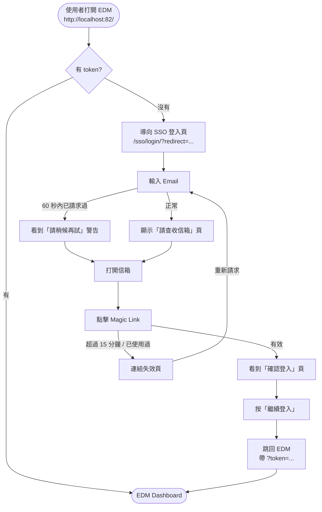

# 使用者流程圖

本文件從**使用者視角**描述 Middle Platform 的登入流程,並補上對應的 Sequence Diagram。

---

## 1. 使用者流程(State Flow)

這張圖回答的是:**使用者會看到哪些畫面、按什麼按鈕、下一步去哪裡。**



**關鍵決策點**
- **為什麼有「確認登入」頁?** 企業信箱的資安掃描器會自動 GET 所有連結,若 GET 就直接消耗 token,使用者會打不開。所以 GET 只顯示畫面,POST 才真正登入。
- **為什麼有 60 秒 cooldown?** 防止連續寄信被當 spam,同時避免使用者誤觸「寄送」多次時信箱塞滿。
- **為什麼 token 有 15 分鐘?** 夠使用者從寄出到收信並點擊,又不至於長到被社交工程攻擊得手。

---

## 2. Sequence Diagram — 完整 SSO 登入流程

這張圖回答的是:**每一個角色、在時間軸上、跟誰說了什麼話。**

```mermaid
sequenceDiagram
    autonumber
    actor U as 使用者
    participant B as Browser
    participant MP as Middle Platform<br/>(Django)
    participant DB as MySQL
    participant M as Email Backend
    participant E as EDM Frontend

    U->>B: 打開 http://localhost:82/
    B->>E: GET /
    E-->>B: 沒 token,redirect 到 /sso/login/?redirect=http://localhost:82/
    B->>MP: GET /sso/login/?redirect=...
    MP-->>B: 渲染登入頁 (login.html)

    U->>B: 輸入 email,按「寄送登入連結」
    B->>MP: POST /sso/login/ {email, redirect}
    MP->>DB: SELECT User WHERE email=?
    alt User 不存在
        MP->>DB: INSERT User (is_active=False)
    end
    MP->>DB: SELECT LoginToken WHERE created_at > now-60s
    alt 60 秒內已存在 token
        MP-->>B: 渲染「請查收信箱」頁 (含 cooldown 警告)
    else 正常路徑
        MP->>MP: raw_token = secrets.token_urlsafe(32)
        MP->>DB: INSERT LoginToken (token_hash=sha256(raw_token), expires_at=now+15m)
        MP->>M: send_mail(to=email, body=含 /sso/magic/&lt;raw_token&gt;/)
        MP-->>B: 渲染「請查收信箱」頁
    end

    U->>M: 打開信箱
    M-->>U: 顯示 Magic Link
    U->>B: 點擊連結
    B->>MP: GET /sso/magic/&lt;raw_token&gt;/
    MP->>DB: SELECT LoginToken WHERE token_hash=sha256(raw_token)
    alt token 過期 / 已用過
        MP-->>B: 410 渲染「連結失效」頁
    else token 有效
        MP-->>B: 渲染「確認登入」頁 (magic_link_confirm.html)
    end

    U->>B: 按「繼續登入」
    B->>MP: POST /sso/magic/&lt;raw_token&gt;/
    MP->>DB: UPDATE LoginToken SET consumed_at=now
    MP->>DB: UPDATE User SET is_active=True (若尚未啟用)
    MP->>MP: django.contrib.auth.login(request, user)
    MP->>MP: jwt = RefreshToken.for_user(user).access_token
    MP-->>B: 302 redirect 到 http://localhost:82/?token=&lt;jwt&gt;

    B->>E: GET /?token=&lt;jwt&gt;
    E->>MP: POST /api/edm/sso/verify-token {token}
    MP->>MP: JWTAuthentication.get_validated_token()
    MP->>DB: SELECT User WHERE id=token.user_id
    MP-->>E: {code:0, data:{accessToken, userInfo}}
    E->>E: 存 accessToken 到 localStorage
    E-->>B: 渲染 Dashboard
    B-->>U: 看到 EDM Dashboard
```

---

## 3. 角色說明

| 角色 | 是誰 | 在這張圖的責任 |
|---|---|---|
| **使用者** | 真人 | 輸入 Email、開信箱、點連結、按確認 |
| **Browser** | 瀏覽器 | 所有 HTTP 請求的代理人;保存 session cookie |
| **Middle Platform** | 本專案 Django | 驗證、發 token、簽 JWT、渲染頁面 |
| **MySQL** | DB 容器 | 存 User、LoginToken、Session、JWT Blacklist |
| **Email Backend** | 可替換元件 | 把信送到使用者信箱(開發為 Console log) |
| **EDM Frontend** | Vue/Vben | 業務系統前台;收到 token 後呼叫中台驗證 |

---

## 4. 與一般「帳密登入」相比的差異

| 項目 | 傳統帳密 | 本系統(Magic Link) |
|---|---|---|
| 註冊 | 需填密碼 | **只需 Email**,首次登入=註冊 |
| 忘記密碼流程 | 需要 | **不存在**(本來就沒密碼) |
| 撞庫 / 弱密碼攻擊 | 有風險 | **免疫**(`set_unusable_password()`) |
| 釣魚風險 | 騙到密碼=永久淪陷 | 騙到 token=15 分鐘且單次 |
| 依賴外部服務 | 僅 DB | **Email 必須穩定** |

這個 tradeoff 記錄在 `docs/adr/0001-passwordless-auth.md`(尚未撰寫,見 Roadmap)。
